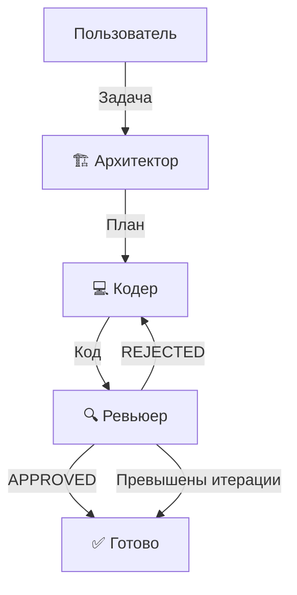

# 🤖 Рой AI-агентов

Система из трёх AI-агентов (Архитектор, Кодер, Ревьюер), которые взаимодействуют через граф LangGraph, используя DeepSeek в качестве LLM.

## Архитектура

```
┌─────────────┐     ┌──────────┐     ┌──────────┐
│  Архитектор  │ ──→ │  Кодер   │ ──→ │ Ревьюер  │
│  (планирует) │     │ (пишет)  │     │(проверяет)│
└─────────────┘     └──────────┘     └─────┬────┘
      ▲                                    │
      │           ┌────────────────┐       │
      │           │  REJECTED?     │ ←─────┘
      │           │  (доработка)   │
      │           └────────────────┘
      │                                    │
      └────────────────────────────────────┘
              (APPROVED → завершение)
```

### Диаграмма Mermaid



### Архитектура с MCP-интеграцией

```
┌─────────────────────────────────────────────────┐
│                   Roo Code                       │
│  ┌───────────────────────────────────────────┐  │
│  │           MCP-клиент Roo Code             │  │
│  └──────────────┬────────────────────────────┘  │
│                 │                                │
└─────────────────┼────────────────────────────────┘
                  │           MCP-протокол (stdio)
                  ▼
┌─────────────────────────────────────────────────┐
│              MCP-сервер swarm-mcp                 │
│                                                  │
│  ┌───────────────────────────────────────────┐  │
│  │           Инструмент run_swarm             │  │
│  └──────────────────┬────────────────────────┘  │
│                     │                            │
└─────────────────────┼────────────────────────────┘
                      │
                      ▼
┌─────────────────────────────────────────────────┐
│              Swarm Runner                        │
│  ┌──────────┐   ┌────────┐   ┌──────────────┐  │
│  │Architect │──→│  Coder  │──→│   Reviewer   │  │
│  └──────────┘   └────────┘   └──────────────┘  │
└─────────────────────────────────────────────────┘
```

Подробное описание архитектуры масштабирования (1000+ файлов) — см. [`plans/swarm-scale-architecture.md`](plans/swarm-scale-architecture.md).

## 🚀 Масштабирование (swarm-scale)

Для промышленной обработки большого количества задач (100+ файлов) используйте пакет [`swarm-scale`](swarm-scale/).

```
┌─────────────────────────────────────────────────────────┐
│                    Swarm Worker                           │
│  ┌─────────┐  ┌──────────┐  ┌──────────────┐           │
│  │  Cache   │  │  Rate    │  │    Model     │           │
│  │ Manager  │  │ Limiter  │  │  Selector    │           │
│  └─────────┘  └──────────┘  └──────────────┘           │
│                                                          │
│  ┌──────────────────────────────────────────────────┐   │
│  │              Swarm (Architect → Coder → Reviewer) │   │
│  └──────────────────────────────────────────────────┘   │
└─────────────────────────────────────────────────────────┘
```

### Возможности

| Функция | Описание |
|---------|----------|
| 🗃️ **Кэш L1/L2/L3** | DiskCache (локально) + Redis (распределённо) + S3 (долгосрочно) |
| ⏱️ **Adaptive Rate Limiter** | Автоматически подстраивается под лимиты DeepSeek API (500 RPM) |
| 🎯 **Model Selector** | deepseek-chat для простых задач, deepseek-reasoner для сложных |
| ⚡ **Параллельная обработка** | N воркеров в ThreadPoolExecutor |
| 📊 **Prometheus метрики** | Количество задач, токенов, ошибок, стоимость |
| ☸️ **Kubernetes** | Готовые deployment.yaml, HPA, kustomization |
| 📋 **Очереди** | InMemoryQueue (для тестов) / KafkaQueue (для продакшена) |

### Использование

```bash
# Установка
pip install -e ./swarm-scale

# CLI
python -m swarm_scale task "Напиши парсер CSV"
python -m swarm_scale batch tasks.json --parallel 5
python -m swarm_scale worker --queue memory

# Через MCP-сервер (автоматически)
# Установи MCP_USE_WORKER=true в .env
echo "MCP_USE_WORKER=true" >> .env
```

## Установка

1. Клонируйте репозиторий:
```bash
git clone <repo-url>
cd swarm
```

2. Установите зависимости:
```bash
pip install -r requirements.txt
```

3. Создайте файл `.env` из `.env.example`:
```bash
copy .env.example .env
```

> **⚠️ Важно:** Файл `.env` добавлен в `.gitignore` — ваш API-ключ не попадёт в репозиторий.

4. Отредактируйте `.env`, указав ваш API-ключ DeepSeek:
```
DEEPSEEK_API_KEY=your_actual_api_key
```

## Использование

### Из командной строки

```bash
python -m swarm.main
```

Или напрямую:

```bash
python swarm/main.py
```

### Из кода Python

```python
from swarm import SwarmRunner

# Создание runner'а
runner = SwarmRunner()

# Запуск роя
result = await runner.run("Напиши функцию на Python для быстрой сортировки (quicksort)")

# Вывод результатов
print("📋 План архитектора:")
print(result["plan"])
print("\n💻 Код:")
print(result["code"])
print("\n🔍 Результат ревью:")
print(result["review_result"])
```

### Пример

```bash
python examples/quicksort.py
```

## MCP-интеграция

Рой AI-агентов упакован в MCP-сервер, что позволяет использовать его как инструмент из Roo Code и других MCP-совместимых клиентов.

### Как это работает

MCP-сервер (`swarm-mcp`) реализует протокол MCP (Model Context Protocol) через stdio-транспорт. При вызове инструмента `run_swarm` сервер:

1. Принимает техническое задание (task) через MCP-протокол
2. Создаёт экземпляр `SwarmRunner` с конфигурацией из `.env`
3. Запускает цикл агентов (Архитектор → Кодер → Ревьюер)
4. Возвращает результат (план, код, ревью) клиенту

### Инструменты MCP

#### `run_swarm`

Запускает команду AI-агентов для написания кода по вашему техническому заданию.

**Параметры:**

| Параметр | Тип | Обязательный | Описание |
|----------|-----|--------------|----------|
| `task` | `string` | Да | Детальное техническое задание на разработку |

**Возвращает:**
- План архитектора
- Итоговый код (в формате Markdown)
- Результат ревью (APPROVED/REJECTED с замечаниями)

**Пример использования в Roo Code:**

```
Запусти рой агентов с задачей: "Напиши REST API на FastAPI для управления задачами (todo list)"
```

### Подключение к Roo Code

MCP-сервер настраивается в файле `.roo/mcp.json` в корне проекта:

```json
{
  "mcpServers": {
    "swarm": {
      "command": "python",
      "args": ["-m", "swarm_mcp"],
      "env": {
        "DEEPSEEK_API_KEY": "${DEEPSEEK_API_KEY}"
      }
    }
  }
}
```

Переменная `${DEEPSEEK_API_KEY}` будет автоматически подставлена из окружения Roo Code.

## Агенты

### 🏗️ Архитектор
- Анализирует задачу пользователя
- Создаёт детальный план реализации
- Описывает архитектуру, компоненты и их взаимодействие

### 💻 Кодер
- Пишет чистый, рабочий код по плану архитектора
- Следует лучшим практикам и паттернам
- Добавляет обработку ошибок

### 🔍 Ревьюер
- Проверяет код на соответствие плану
- Оценивает качество и корректность
- Возвращает APPROVED или REJECTED с замечаниями

## Цикл работы

1. Пользователь вводит задачу
2. Архитектор создаёт план
3. Кодер пишет код по плану
4. Ревьюер проверяет код
5. Если код принят (APPROVED) — процесс завершается
6. Если код отклонён (REJECTED) — кодер дорабатывает код
7. Если превышено максимальное количество итераций — процесс завершается принудительно

## Требования

- Python 3.10+
- API-ключ DeepSeek
- MCP SDK (`pip install mcp`) — для MCP-интеграции

## Лицензия

MIT

## 🔌 Быстрый старт MCP

### Подключение к Roo Code

MCP-сервер уже настроен в [`.roo/mcp.json`](.roo/mcp.json) как `swarm`.

### Проверка работы

```bash
# Запустить MCP-сервер вручную
python -m swarm_mcp

# Или проверить через Python
python -c "
import asyncio
from swarm_mcp import create_server, MCPConfig

async def test():
    config = MCPConfig()
    server = create_server(config)
    print(f'MCP сервер {config.server_name} готов')
    print(f'Режим: {\"Worker (кэш + rate limiter)\" if config.use_worker else \"Прямой SwarmRunner\"}')
    print(f'API ключ: {\"настроен\" if config.swarm.deepseek_api_key else \"НЕ НАСТРОЕН\"}')

asyncio.run(test())
```

### Пример вызова из Roo Code

В режиме `code` просто дайте задачу. Roo Code сам вызовет `run_swarm`:

```
Напиши парсер JSON-логов на Python
```

При необходимости укажите сложность (опционально):

```
run_swarm(task="Рефакторинг архитектуры БД", complexity="high", project_files=500)
```
