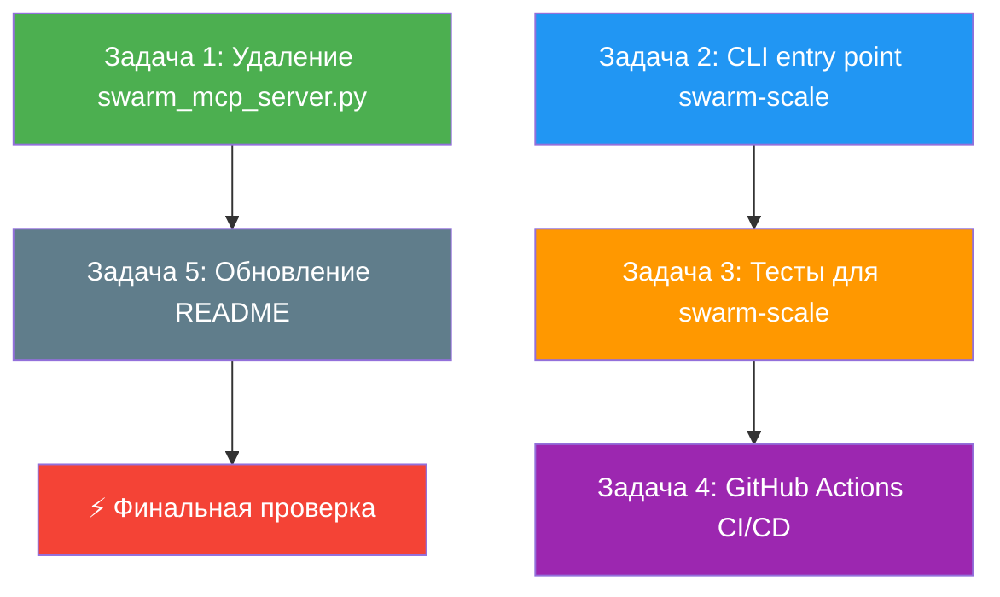
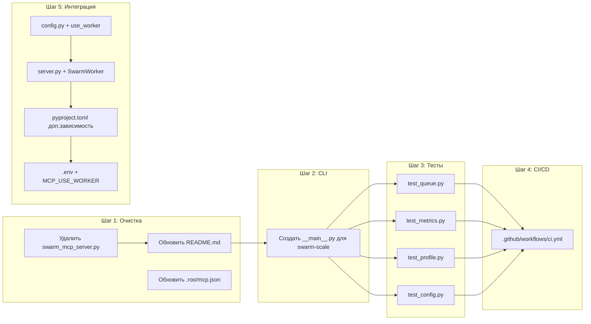

# План доработки проекта Swarm до завершённого состояния

## Сводка зависимостей между задачами



**Порядок выполнения:** 1 → 2 → 3 → 4 → 5 (каждая задача может делаться отдельным sub-агентом)

---

## Задача 1: Удаление корневого `swarm_mcp_server.py`

### Статус: независимая, может быть первой

### Что нужно сделать

**1.1. Проверить отсутствие импортов** (уже сделано в рамках анализа)

Результат проверки:
- Ни один `.py` файл не импортирует `swarm_mcp_server`
- Файл упоминается только в `README.md` (строки 47-48, 133, 172) и в `plans/swarm-scale-architecture.md` (строка 641)
- `.roo/mcp.json` упоминает `"args": ["swarm_mcp_server.py"]`

**1.2. Обновить `README.md`**

Заменить:
- Строки 47-48: `(swarm_mcp_server.py)` → `(пакет swarm-mcp)`
- Строку 133: `MCP-сервер (\`swarm_mcp_server.py\`)` → `MCP-сервер (\`swarm-mcp\`)`
- Строки 171-172: `"command": "python", "args": ["swarm_mcp_server.py"]` → `"command": "python", "args": ["-m", "swarm_mcp"]`

**1.3. Обновить `.roo/mcp.json`** (если существует)

Заменить аргумент запуска с `swarm_mcp_server.py` на `-m swarm_mcp`.

**1.4. Обновить `plans/swarm-scale-architecture.md`**

Строка 641: удалить `COPY swarm_mcp_server.py .` из примера Dockerfile.

**1.5. Удалить файл**

`swarm_mcp_server.py` — просто удалить.

### Файлы для изменения

| Файл | Действие |
|------|----------|
| `README.md` | Изменить (3 места) |
| `.roo/mcp.json` | Изменить (если существует) |
| `plans/swarm-scale-architecture.md` | Изменить (1 место) |
| `swarm_mcp_server.py` | **Удалить** |

---

## Задача 2: CLI entry point для swarm-scale

### Статус: независимая, критична для Dockerfile

### Спецификация `swarm-scale/src/swarm_scale/__main__.py`

Файл должен предоставлять три режима через `argparse`:

```python
# argparse интерфейс:
# python -m swarm_scale task "Напиши тест"          # single task
# python -m swarm_scale batch tasks.json             # batch из JSON-файла
# python -m swarm_scale worker --queue kafka         # daemon/worker mode
# python -m swarm_scale worker --queue memory        # daemon с in-memory очередью
# python -m swarm_scale --help
```

#### Аргументы:

| Аргумент | Описание |
|----------|----------|
| `task <text>` | Выполнить одну задачу |
| `batch <file>` | Выполнить батч задач из JSON-файла (список Task) |
| `worker` | Запустить воркер в режиме daemon |
| `--config <path>` | Путь к .env файлу (опционально) |
| `--workers <N>` | Количество воркеров (по умолчанию из ScaleConfig) |
| `--queue {memory,kafka}` | Тип очереди для worker mode |
| `--metrics-port <port>` | Порт для Prometheus метрик |
| `--verbose` | Подробный вывод |

#### Логика работы:

**Режим `task`:** 
1. Загружает `ScaleConfig` (из `--config` или `.env`)
2. Создаёт `SwarmWorker`
3. Создаёт `Task` из аргумента
4. Запускает `worker.process_task(task)`
5. Выводит результат в JSON/pretty format

**Режим `batch`:**
1. Загружает задачи из JSON-файла
2. Создаёт `SwarmWorker`
3. Запускает `worker.process_batch(tasks)`
4. Сохраняет результаты в `<input>_results.json`
5. Выводит сводку (успешно/ошибки/кэш)

**Режим `worker`:**
1. Создаёт очередь (InMemoryQueue или KafkaQueue)
2. Запускает Prometheus metrics server (если включено)
3. Цикл: pop → process → acknowledge → pop
4. Graceful shutdown по Ctrl+C

### Файлы для создания/изменения

| Файл | Действие |
|------|----------|
| `swarm-scale/src/swarm_scale/__main__.py` | **Создать** |

---

## Задача 3: Недостающие тесты для swarm-scale

### Статус: зависит от Задачи 2 (нужен `__main__.py` для полного покрытия, но тесты модулей независимы)

### 3.1. `swarm-scale/tests/test_queue.py`

Тесты для `InMemoryQueue` и `KafkaQueue`:

```python
class TestInMemoryQueue:
    # test_push_pop — добавить и извлечь задачу
    # test_pop_empty — возврат None при пустой очереди
    # test_acknowledge — подтверждение обработки
    # test_size — корректный размер очереди
    # test_priority_order — FIFO порядок

class TestKafkaQueue:
    # test_push_requires_bootstrap — ошибка без сервера (graceful)
    # test_pop_timeout — возврат None при таймауте
    # test_size_returns_minus_one — Kafka не знает размер
```

**Ключевые моменты:**
- `KafkaQueue.push()` и `pop()` должны быть протестированы с mock'ами `aiokafka`
- Проверить, что `KafkaQueue.push()` не падает, если Kafka недоступна (graceful degradation)
- `InMemoryQueue` должно быть полностью синхронно-тестируемо через asyncio

### 3.2. `swarm-scale/tests/test_metrics.py`

Тесты для Prometheus метрик:

```python
class TestMetrics:
    # test_record_task_completed — инкремент completed
    # test_record_task_failed — инкремент failed
    # test_record_task_cached — инкремент cached
    # test_record_tokens — запись токенов с label модели
    # test_record_cost — запись стоимости
    # test_start_metrics_server — запуск HTTP-сервера
    # test_metrics_independence — метрики не влияют друг на друга
```

**Ключевые моменты:**
- После каждого теста сбрасывать метрики (чтобы не влияли друг на друга)
- `start_metrics_server()` тестировать через проверку, что сервер запущен на указанном порту

### 3.3. `swarm-scale/tests/test_profile.py`

Тесты для `ProfileManager` и `ProjectProfile`:

```python
class TestProjectProfile:
    # test_create_profile — создание с минимальными полями
    # test_create_full_profile — создание со всеми полями
    # test_default_values — проверка значений по умолчанию

class TestProfileManager:
    # test_register — регистрация профиля
    # test_get_by_id — получение по profile_id
    # test_get_by_repository — поиск по репозиторию
    # test_get_nonexistent — None для несуществующего
    # test_remove — удаление профиля
    # test_remove_nonexistent — False при удалении отсутствующего
    # test_count — количество профилей
    # test_register_duplicate — перезапись при дубликате
```

### 3.4. `swarm-scale/tests/test_config.py`

Тесты для `ScaleConfig`:

```python
class TestScaleConfig:
    # test_default_values — разумные значения по умолчанию
    # test_from_env — загрузка из переменных окружения
    # test_swarm_lazy_loading — SwarmConfig создаётся лениво
    # test_swarm_with_dict — swarm_config из словаря
    # test_custom_values — все поля переопределяются
```

**Ключевые моменты:**
- `monkeypatch` для установки переменных окружения в `test_from_env`
- Проверить, что `swarm` property не вызывает `from_env()` повторно (кэширование)

### Файлы для создания

| Файл | Действие |
|------|----------|
| `swarm-scale/tests/test_queue.py` | **Создать** |
| `swarm-scale/tests/test_metrics.py` | **Создать** |
| `swarm-scale/tests/test_profile.py` | **Создать** |
| `swarm-scale/tests/test_config.py` | **Создать** |

---

## Задача 4: GitHub Actions CI/CD

### Статус: зависит от Задачи 3 (нужны тесты для осмысленного CI)

### Спецификация `.github/workflows/ci.yml`

```yaml
name: CI

on:
  push:
    branches: [main, develop]
  pull_request:
    branches: [main]

jobs:
  lint:
    runs-on: ubuntu-latest
    strategy:
      matrix:
        module: [swarm, swarm-mcp, swarm-scale]
    steps:
      - uses: actions/checkout@v4
      - uses: actions/setup-python@v5
        with:
          python-version: "3.12"
      - name: Install module
        run: |
          cd ${{ matrix.module }}
          pip install -r requirements.txt
      - name: Lint with ruff
        run: ruff check ${{ matrix.module }}/src/

  test:
    runs-on: ubuntu-latest
    needs: lint
    strategy:
      matrix:
        module: [swarm, swarm-mcp, swarm-scale]
    steps:
      - uses: actions/checkout@v4
      - uses: actions/setup-python@v5
        with:
          python-version: "3.12"
      - name: Install dependencies
        run: |
          # Установка swarm сначала (зависимость для swarm-mcp и swarm-scale)
          cd swarm && pip install -e . && cd ..
          cd ${{ matrix.module }} && pip install -r requirements.txt && pip install -e . && cd ..
      - name: Run tests
        run: |
          cd ${{ matrix.module }}
          python -m pytest tests/ -v
      - name: Check imports
        run: |
          cd ${{ matrix.module }}
          python -c "import ${{ matrix.module == 'swarm' && 'swarm' || matrix.module == 'swarm-mcp' && 'swarm_mcp' || 'swarm_scale' }}; print('OK')"

  docker:
    runs-on: ubuntu-latest
    needs: test
    if: github.event_name == 'push' && github.ref == 'refs/heads/main'
    steps:
      - uses: actions/checkout@v4
      - name: Build swarm-mcp image
        run: docker build -t swarm-mcp:latest ./swarm-mcp
      - name: Build swarm-scale image
        run: docker build -t swarm-scale:latest ./swarm-scale
```

### Файлы для создания

| Файл | Действие |
|------|----------|
| `.github/workflows/ci.yml` | **Создать** |

---

## Задача 5: Интеграция SwarmWorker в MCP-сервер

### Статус: независимая, но требует понимания обоих модулей (swarm-mcp + swarm-scale)

### Спецификация изменений в MCP-сервере

**5.1. `swarm-mcp/src/swarm_mcp/config.py` — добавить поле:**

```python
@dataclass
class MCPConfig:
    # ... существующие поля ...
    use_worker: bool = False      # Использовать SwarmWorker вместо прямого SwarmRunner
    worker_config: Optional[dict] = None  # Параметры для ScaleConfig (если use_worker=True)
```

**5.2. `swarm-mcp/src/swarm_mcp/server.py` — опциональное использование SwarmWorker:**

В `call_tool` добавить ветку:

```python
if cfg.use_worker:
    # Используем SwarmWorker с кэшем и rate limiter
    from swarm_scale import SwarmWorker, ScaleConfig
    from swarm_scale.task import Task
    
    scale_config = ScaleConfig()
    worker = SwarmWorker(scale_config)
    task = Task(
        task_id=f"mcp-{uuid.uuid4().hex[:8]}",
        content=task_text,
        repository="mcp-client",
        file_path="unknown",
    )
    result = await worker.process_task(task)
    # ... форматирование результата ...
else:
    # Существующая логика с прямым SwarmRunner
    runner = SwarmRunner(cfg.swarm)
    # ...
```

**5.3. `swarm-mcp/pyproject.toml` — добавить опциональную зависимость:**

```toml
[project.optional-dependencies]
scale = ["swarm-scale"]
```

**5.4. Обновить `.env` документацию — добавить переменную:**

```
MCP_USE_WORKER=false    # true для использования SwarmWorker с кэшем
```

### Файлы для изменения

| Файл | Действие |
|------|----------|
| `swarm-mcp/src/swarm_mcp/config.py` | **Изменить** — добавить use_worker, worker_config |
| `swarm-mcp/src/swarm_mcp/server.py` | **Изменить** — добавить ветку с SwarmWorker |
| `swarm-mcp/pyproject.toml` | **Изменить** — optional-dependencies scale |
| `.env` | **Изменить** — добавить MCP_USE_WORKER |
| `.env.example` | **Изменить** — добавить MCP_USE_WORKER |

---

## Полный список файлов для создания/изменения/удаления

### Создать (6 файлов)

| # | Путь | Ответственный |
|---|------|--------------|
| 1 | `swarm-scale/src/swarm_scale/__main__.py` | Code mode |
| 2 | `swarm-scale/tests/test_queue.py` | Code mode |
| 3 | `swarm-scale/tests/test_metrics.py` | Code mode |
| 4 | `swarm-scale/tests/test_profile.py` | Code mode |
| 5 | `swarm-scale/tests/test_config.py` | Code mode |
| 6 | `.github/workflows/ci.yml` | Code mode |

### Изменить (8 файлов)

| # | Путь | Что менять |
|---|------|------------|
| 1 | `README.md` | Заменить `swarm_mcp_server.py` → `swarm -m swarm_mcp` |
| 2 | `.roo/mcp.json` | Исправить путь запуска MCP-сервера |
| 3 | `plans/swarm-scale-architecture.md` | Убрать COPY swarm_mcp_server.py |
| 4 | `swarm-mcp/src/swarm_mcp/config.py` | Добавить use_worker, worker_config |
| 5 | `swarm-mcp/src/swarm_mcp/server.py` | Ветка с SwarmWorker |
| 6 | `swarm-mcp/pyproject.toml` | optional-dependencies scale |
| 7 | `.env` | MCP_USE_WORKER |
| 8 | `.env.example` | MCP_USE_WORKER |

### Удалить (1 файл)

| # | Путь |
|---|------|
| 1 | `swarm_mcp_server.py` |

---

## Граф зависимостей и порядок выполнения



**Оптимальный порядок выполнения (4 параллельных потока):**

| Поток | Задачи | Может стартовать |
|-------|--------|------------------|
| **A** | Шаг 1 (очистка) | Сразу |
| **B** | Шаг 2 → Шаг 3 (CLI → тесты) | После A |
| **C** | Шаг 4 (CI/CD) | После B |
| **D** | Шаг 5 (интеграция) | Сразу (параллельно с A) |

**Итого: 4 последовательных шага с возможностью параллельного выполнения потока D.**

---

## Чек-лист проверки завершённости

После выполнения всех задач проверить:

- [ ] `swarm_mcp_server.py` удалён, и нигде не упоминается
- [ ] `python -m swarm_scale --help` выводит справку
- [ ] `python -m swarm_scale task "test" --dry-run` работает
- [ ] Все тесты swarm-scale проходят: `pytest swarm-scale/tests/ -v`
- [ ] Все тесты swarm-mcp проходят: `pytest swarm-mcp/tests/ -v`
- [ ] Все тесты swarm проходят: `pytest swarm/tests/ -v`
- [ ] `ruff check swarm/ swarm-mcp/ swarm-scale/` без ошибок
- [ ] MCP-сервер запускается через `python -m swarm_mcp`
- [ ] MCP-сервер с `use_worker=true` импортирует swarm_scale без ошибок
- [ ] CI workflow создан и синтаксически корректен
