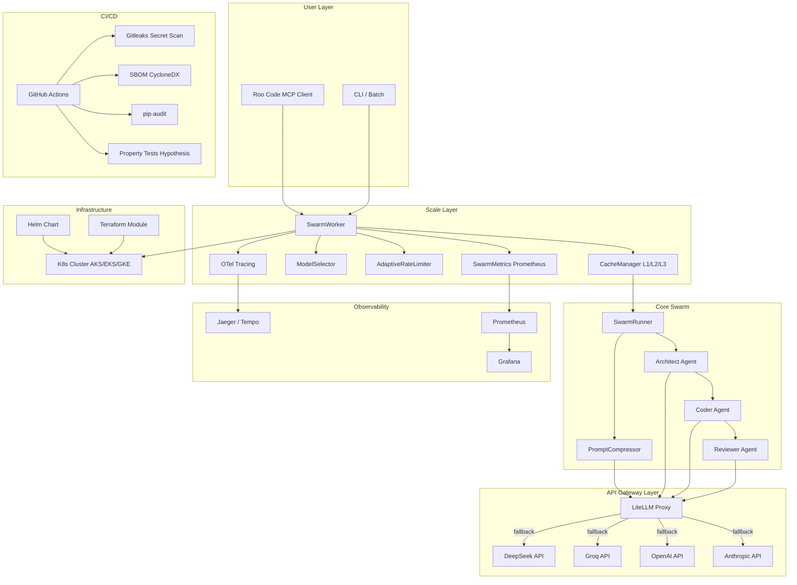
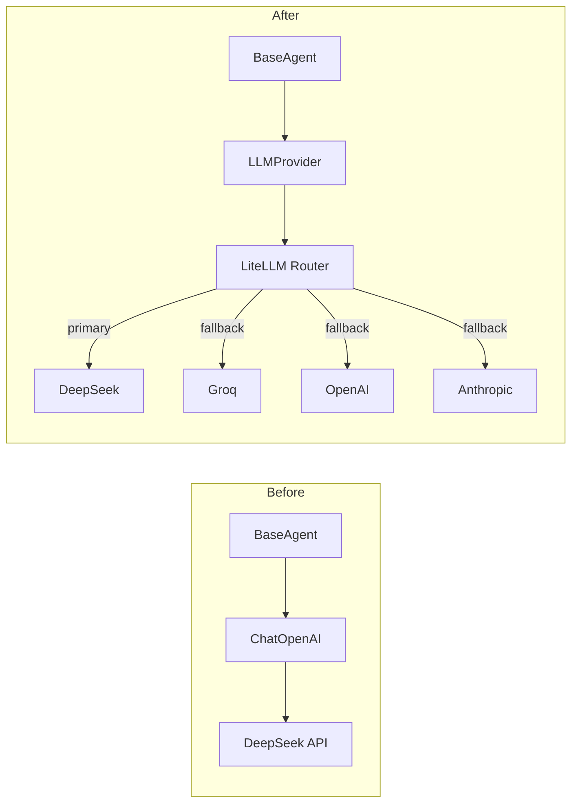
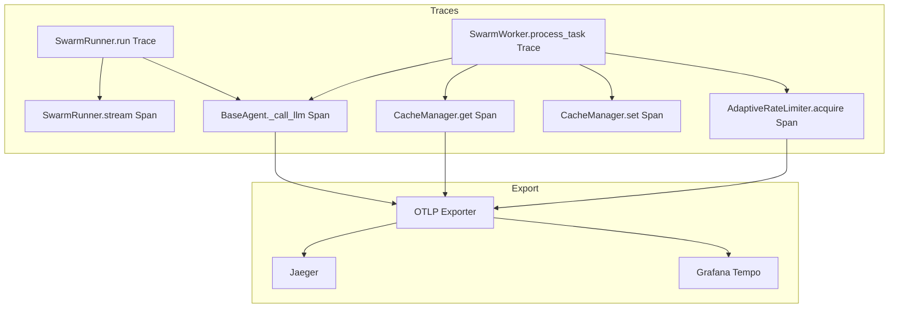
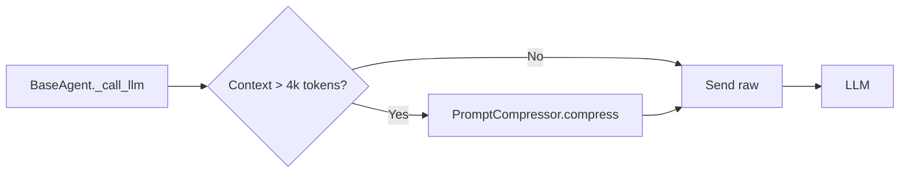
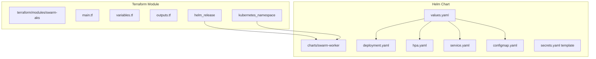
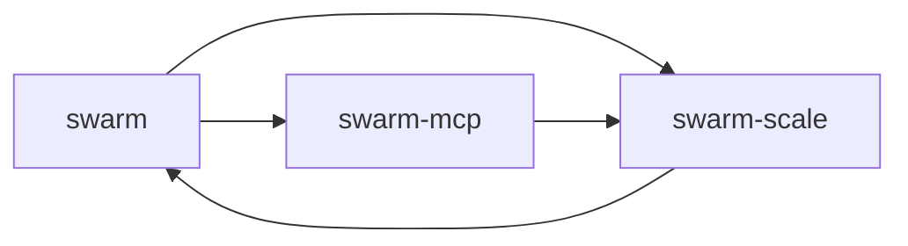
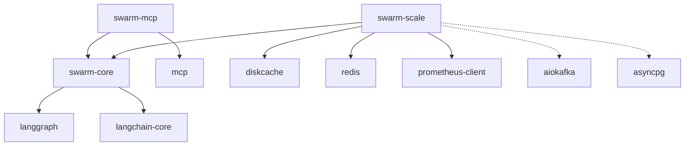
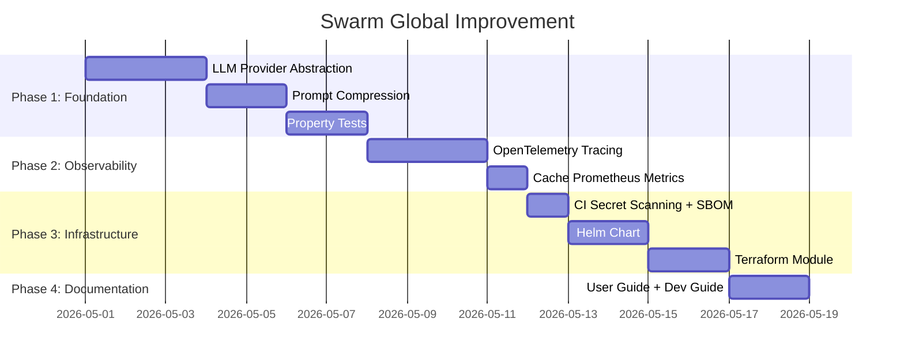

# Архитектурный план улучшения Swarm до мирового уровня (9/10)

**Версия:** 1.0  
**Дата:** 2026-04-30  
**Цель:** Повышение качества проекта Swarm с текущего уровня ~6/10 до промышленного 9/10  

---

## Сводная архитектурная диаграмма (целевое состояние)



---

## 1. LLM Provider Abstraction (через LiteLLM)

### Текущая проблема
Жёсткая привязка к [`ChatOpenAI`](swarm/config.py:69) из `langchain-openai`. [`SwarmConfig._create_llm()`](swarm/config.py:55) всегда создаёт `ChatOpenAI`, даже если нужно использовать Anthropic или Groq. [`BaseAgent.__init__()`](swarm/agents/base.py:24) принимает только `ChatOpenAI`. [`ModelSelector.select()`](swarm-scale/src/swarm_scale/model_selector.py:58) хардкодит `deepseek-chat` / `deepseek-reasoner`.

### Целевая архитектура



### Файлы для создания/изменения

| Файл | Действие | Описание |
|------|----------|----------|
| `swarm/llm/__init__.py` | **Создать** | Пакет для LLM абстракции |
| `swarm/llm/base.py` | **Создать** | `BaseLLMProvider` — абстрактный класс |
| `swarm/llm/litellm_provider.py` | **Создать** | `LiteLLMProvider` — реализация через LiteLLM |
| `swarm/llm/config.py` | **Создать** | `ProviderConfig` — dataclass с настройками провайдеров |
| `swarm/config.py` | **Изменить** | Заменить `_create_llm()` на `create_provider()`, убрать `ChatOpenAI` |
| `swarm/agents/base.py` | **Изменить** | `BaseAgent.__init__()` принимает `BaseLLMProvider`, не `ChatOpenAI` |
| `swarm-scale/src/swarm_scale/model_selector.py` | **Изменить** | `ModelConfig` хранит `provider: str`, а не `architect/coder/reviewer` модели |
| `swarm-scale/src/swarm_scale/worker.py` | **Изменить** | Передавать `provider` вместо `model_name` в `SwarmConfig` |
| `.env.example` | **Изменить** | Добавить `LITELLM_MASTER_KEY`, `FALLBACK_PROVIDERS` |

### Интерфейсы/контракты

```python
# swarm/llm/base.py
class BaseLLMProvider(ABC):
    @abstractmethod
    async def call(
        self,
        messages: list[dict[str, str]],
        model: str,
        temperature: float = 0.1,
        max_tokens: int | None = None,
    ) -> LLMResponse: ...

    @abstractmethod
    async def call_with_fallback(
        self,
        messages: list[dict[str, str]],
        model: str,
        fallback_models: list[str] | None = None,
    ) -> LLMResponse: ...

    @property
    @abstractmethod
    def provider_name(self) -> str: ...

@dataclass
class LLMResponse:
    content: str
    model: str
    provider: str
    prompt_tokens: int
    completion_tokens: int
    latency_sec: float

# swarm/llm/litellm_provider.py
class LiteLLMProvider(BaseLLMProvider):
    def __init__(self, config: ProviderConfig):
        self.client = LiteLLMProxy(
            router=Router(
                model_list=[
                    {"model_name": "deepseek-chat", "litellm_params": {"model": "deepseek/deepseek-chat", "api_key": "..."}},
                    {"model_name": "gpt-4o", "litellm_params": {"model": "openai/gpt-4o", "api_key": "..."}},
                    {"model_name": "claude-3-opus", "litellm_params": {"model": "anthropic/claude-3-opus", "api_key": "..."}},
                ],
                fallbacks=[{"deepseek-chat": ["groq/llama3-70b"]}],
            )
        )
```

### Зависимости (добавить в `requirements.txt` и `swarm/pyproject.toml`)

| Пакет | Зачем |
|-------|-------|
| `litellm>=1.40.0` | AI Gateway / прокси-маршрутизация |
| `openai>=1.0.0` | OpenAI SDK (базовый для LiteLLM) |
| `anthropic>=0.30.0` | Anthropic SDK (опционально) |

### Риски

| Риск | Митигация |
|------|-----------|
| LiteLLM добавляет latency (~50-100ms на маршрутизацию) | Использовать `router.acheapest()` для простых задач; кэшировать маршруты |
| Совместимость streaming-режимов у разных провайдеров | Всегда использовать non-streaming для совместимости |
| Разные форматы ответов (token usage) | Нормализовать через `LLMResponse` dataclass |
| LiteLLM может упасть целиком | Добавить health-check и direct fallback на OpenAI SDK |

---

## 2. OpenTelemetry Distributed Tracing

### Текущая проблема
Никакого трейсинга нет. Есть только Prometheus метрики (счётчики). Невозможно понять, где именно теряется время — в LLM вызове, в кэше, или в rate limiter.

### Целевая архитектура



### Файлы для создания/изменения

| Файл | Действие | Описание |
|------|----------|----------|
| `swarm/tracing.py` | **Создать** | Инициализация tracer provider, OTLP exporter |
| `swarm/agents/base.py` | **Изменить** | Обернуть `_call_llm()` в `start_as_current_span` |
| `swarm/main.py` | **Изменить** | `SwarmRunner.run()` — trace на весь граф |
| `swarm-scale/src/swarm_scale/worker.py` | **Изменить** | `process_task()` — trace через pipeline |
| `swarm-scale/src/swarm_scale/cache.py` | **Изменить** | `CacheManager.get/set` — span на каждый вызов |
| `swarm-scale/src/swarm_scale/rate_limiter.py` | **Изменить** | `acquire()` — span на ожидание |
| `swarm-config.yaml` | **Создать** | OTel SDK конфиг (OTEL_EXPORTER_OTLP_ENDPOINT) |

### Интерфейсы/контракты

```python
# swarm/tracing.py
from opentelemetry import trace
from opentelemetry.exporter.otlp.proto.grpc.trace_exporter import OTLPSpanExporter
from opentelemetry.sdk.trace import TracerProvider
from opentelemetry.sdk.trace.export import BatchSpanProcessor

def setup_tracing(service_name: str = "swarm", endpoint: str = "http://localhost:4317") -> trace.Tracer:
    provider = TracerProvider()
    processor = BatchSpanProcessor(OTLPSpanExporter(endpoint=endpoint))
    provider.add_span_processor(processor)
    trace.set_tracer_provider(provider)
    return provider.get_tracer(service_name)

# Использование в BaseAgent._call_llm()
def _call_llm(self, messages: list[dict]) -> str:
    with self.tracer.start_as_current_span("llm.call") as span:
        span.set_attribute("model", self._model)
        span.set_attribute("messages_count", len(messages))
        span.set_attribute("prompt_tokens", response.prompt_tokens)
        span.set_attribute("completion_tokens", response.completion_tokens)
        span.set_attribute("latency_sec", latency)
        ...
```

### Зависимости (добавить)

| Пакет | Зачем |
|-------|-------|
| `opentelemetry-api>=1.25.0` | OTel API |
| `opentelemetry-sdk>=1.25.0` | OTel SDK |
| `opentelemetry-exporter-otlp-proto-grpc>=1.25.0` | Экспорт в Jaeger/Tempo через OTLP |
| `opentelemetry-instrumentation-asyncio>=0.45b0` | Context propagation через asyncio |

### Риски

| Риск | Митигация |
|------|-----------|
| Overhead от трейсинга (каждый LLM вызов → span → экспорт) | Использовать `BatchSpanProcessor` с `max_queue_size=2048` и `scheduled_delay=5000ms` |
| OTLP endpoint недоступен | Processor должен быть non-blocking, ошибки экспорта не должны ронять приложение |
| Context propagation в asyncio | Использовать `start_as_current_span` с `context=token` |
| Стоимость Jaeger/Tempo в облаке | Для малых масштабов — `ConsoleSpanExporter` в dev |

---

## 3. Cache Hit Ratio Метрики (Prometheus)

### Текущая проблема
[`CacheManager`](swarm-scale/src/swarm_scale/cache.py:112) считает `hits` вручную в словаре, но не экспортирует их в Prometheus. [`SwarmMetrics`](swarm-scale/src/swarm_scale/metrics.py:63) имеет `tasks_total` с лейблом `status` (cached/completed/failed), но нет отдельных метрик по уровням кэша и latency.

### Файлы для создания/изменения

| Файл | Действие | Описание |
|------|----------|----------|
| `swarm-scale/src/swarm_scale/cache.py` | **Изменить** | Добавить инкремент Prometheus counters в `get()`/`set()` |
| `swarm-scale/src/swarm_scale/metrics.py` | **Изменить** | Добавить `cache_hit_total`, `cache_miss_total`, `cache_latency_seconds` |
| `swarm-scale/monitoring/grafana-dashboard.json` | **Изменить** | Добавить панели cache hit rate, cache latency |
| `swarm-scale/monitoring/prometheus.yml` | **Изменить** | Добавить правила алертов для cache hit rate |

### Интерфейсы/контракты

```python
# Новые метрики в metrics.py
cache_hit_total = Counter(
    "swarm_cache_hit_total",
    "Cache hits by layer",
    ["layer"],  # l1, l2, l3
)
cache_miss_total = Counter(
    "swarm_cache_miss_total",
    "Cache misses by layer",
    ["layer"],
)
cache_latency_seconds = Histogram(
    "swarm_cache_latency_seconds",
    "Cache operation latency",
    ["operation", "layer"],  # get, set
    buckets=[0.001, 0.005, 0.01, 0.05, 0.1, 0.5, 1.0],
)

# Использование в CacheManager.get()
async def get(self, task, profile_id=None):
    start = time.time()
    key = self.make_key(task, profile_id)
    
    result = self.l1.get(key)
    if result:
        cache_hit_total.labels(layer="l1").inc()
        cache_latency_seconds.labels(operation="get", layer="l1").observe(time.time() - start)
        return result
    
    # ... L2, L3 ...
    cache_miss_total.labels(layer="l1").inc()
```

### Зависимости
Уже есть `prometheus-client>=0.19.0` в `swarm-scale/pyproject.toml`.

### Риски

| Риск | Митигация |
|------|-----------|
| Cardinality explosion по лейблу `layer` | Всего 3 значения — безопасно |
| Забыть обновить метрики при добавлении L3 | Добавить комментарий в код `CacheManager` |

---

## 4. Prompt Compression (LLMLingua)

### Текущая проблема
Промпты отправляются в LLM без сжатия. Для больших контекстов (>4k токенов) это приводит к избыточному расходу токенов и увеличению latency.

### Целевая архитектура



### Файлы для создания/изменения

| Файл | Действие | Описание |
|------|----------|----------|
| `swarm/compression.py` | **Создать** | `PromptCompressor` — обёртка над LLMLingua |
| `swarm/agents/base.py` | **Изменить** | Вызывать `compress()` перед `_call_llm()` для больших контекстов |
| `swarm-scale/src/swarm_scale/worker.py` | **Изменить** | Параметр `enable_compression` в `ScaleConfig` |

### Интерфейсы/контракты

```python
# swarm/compression.py
from llmlingua import PromptCompressor as LLMLinguaCompressor

class PromptCompressor:
    def __init__(self, rate: float = 0.5, min_tokens: int = 4096):
        self._compressor = LLMLinguaCompressor(
            model_name="microsoft/llmlingua-2-xlm-r-100.1m",
            device_map="cpu",  # или "cuda" если GPU доступен
        )
        self.rate = rate
        self.min_tokens = min_tokens
    
    def compress(self, messages: list[dict]) -> list[dict]:
        """Сжимает историю сообщений, если она превышает min_tokens."""
        total_chars = sum(len(m.get("content", "")) for m in messages)
        # Грубая оценка: ~4 символа = 1 токен для английского
        estimated_tokens = total_chars / 4
        
        if estimated_tokens < self.min_tokens:
            return messages  # не сжимаем маленькие контексты
        
        # Сжимаем только контент user-сообщений
        compressed = []
        for msg in messages:
            if msg.get("role") == "user" and len(msg.get("content", "")) > 500:
                compressed.append({
                    **msg,
                    "content": self._compressor.compress(
                        msg["content"],
                        rate=self.rate,
                        force_tokens=[],
                    )["compressed_prompt"],
                })
            else:
                compressed.append(msg)
        return compressed
```

### Зависимости (добавить в `swarm/pyproject.toml`)

| Пакет | Зачем |
|-------|-------|
| `llmlingua>=0.3.0` | Prompt compression от Microsoft |
| `transformers>=4.40.0` | Модель LLMLingua (трансформер) |
| `torch>=2.0.0` | PyTorch для инференса модели сжатия |

### Риски

| Риск | Митигация |
|------|-----------|
| LLMLingua грузит модель ~300MB в RAM | Использовать `device_map="cpu"`; опциональный импорт |
| Сжатие может удалить важный контекст | `force_tokens` — сохранять ключевые слова; A/B-тест сжатых vs несжатых |
| LLMLingua может быть не установлена | Graceful fallback: `try: import llmlingua; except ImportError: pass` |
| PyTorch ~2GB | Сделать LLMLingua опциональной зависимостью (`pip install swarm[compression]`) |

---

## 5. CI: Secret Scanning + SBOM

### Текущая проблема
В [`.github/workflows/ci.yml`](.github/workflows/ci.yml) есть lint, test, import-check, docker. Нет ни secret scanning, ни генерации SBOM, ни проверки уязвимостей.

### Файлы для создания/изменения

| Файл | Действие | Описание |
|------|----------|----------|
| `.github/workflows/ci.yml` | **Изменить** | Добавить jobs: `secret-scan`, `sbom`, `vulnerability-scan` |
| `.github/workflows/security.yml` | **Создать** | Отдельный workflow для security (scan по расписанию) |
| `.gitleaks.toml` | **Создать** | Конфиг gitleaks: правила, allowlists |

### Изменения в CI

```yaml
# Новые jobs в ci.yml

secret-scan:
  runs-on: ubuntu-latest
  steps:
    - uses: actions/checkout@v4
      with:
        fetch-depth: 0
    - name: Gitleaks
      uses: gitleaks/gitleaks-action@v2
      with:
        config-path: .gitleaks.toml

sbom:
  runs-on: ubuntu-latest
  steps:
    - uses: actions/checkout@v4
    - name: Generate SBOM (CycloneDX)
      uses: CycloneDX/gh-python-generate-sbom@v1
      with:
        path: .
        output: ./sbom.json
    - name: Upload SBOM
      uses: actions/upload-artifact@v4
      with:
        name: sbom
        path: ./sbom.json

vulnerability-scan:
  runs-on: ubuntu-latest
  needs: sbom
  steps:
    - uses: actions/checkout@v4
    - name: Install pip-audit
      run: pip install pip-audit
    - name: Check swarm dependencies
      run: pip-audit -r swarm/requirements.txt
    - name: Check swarm-scale dependencies
      run: pip-audit -r swarm-scale/requirements.txt
    - name: Check swarm-mcp dependencies
      run: pip-audit -r swarm-mcp/requirements.txt
```

### Зависимости (CI-level)

| Инструмент | Зачем |
|------------|-------|
| `gitleaks/gitleaks-action@v2` | Secret scanning в PR |
| `CycloneDX/gh-python-generate-sbom@v1` | Генерация SBOM CycloneDX |
| `pip-audit` | Проверка уязвимостей Python пакетов |

### Риски

| Риск | Митигация |
|------|-----------|
| Gitleaks false positives на тестовые ключи | Настроить `.gitleaks.toml` allowlist для тестовых данных |
| pip-audit может занять >5 минут на 3 модуля | Параллелизация через `strategy.matrix` |
| SBOM негде хранить | Upload as build artifact, publish to GH Releases |

---

## 6. Property-based тесты (Hypothesis)

### Текущая проблема
Тесты в [`swarm-scale/tests/`](swarm-scale/tests/) используют обычные `pytest` с фиксированными примерами. Нет property-based тестов, которые проверяют инварианты для широкого диапазона входных данных.

### Файлы для создания/изменения

| Файл | Действие | Описание |
|------|----------|----------|
| `swarm-scale/tests/test_cache_properties.py` | **Создать** | Property-based тесты для Cache стратегий |
| `swarm-scale/tests/test_rate_limiter_properties.py` | **Создать** | Property-based тесты для RateLimiter |
| `swarm-scale/tests/test_model_selector_properties.py` | **Создать** | Property-based тесты для ModelSelector |
| `swarm-scale/tests/test_task_properties.py` | **Создать** | Property-based тесты для Task serialization |
| `swarm-scale/pyproject.toml` | **Изменить** | Добавить `hypothesis` в `[project.optional-dependencies] test` |

### Интерфейсы/контракты

```python
# test_cache_properties.py
from hypothesis import given, strategies as st
from swarm_scale.task import Task

# Стратегия: любые TTL + content → одинаковый результат
@given(
    content=st.text(min_size=1, max_size=1000),
    ttl=st.integers(min_value=1, max_value=168),  # 1h-7d
    repo=st.from_regex(r"[a-z]+/[a-z]+"),
)
def test_cache_strategy_invariant(content, ttl, repo):
    """Для любых TTL и содержимого: кэш возвращает то же, что положили."""
    cache = DiskCache(ttl_hours=ttl)
    task = Task(task_id="test", content=content, repository=repo, file_path="test.py")
    key = cache.make_key(task)
    value = {"plan": "p", "code": f"print('{content}')"}
    
    cache.set(key, value)
    result = cache.get(key)
    
    assert result == value

# test_rate_limiter_properties.py
@given(
    max_rpm=st.integers(min_value=10, max_value=1000),
    num_requests=st.integers(min_value=1, max_value=100),
)
async def test_rate_limiter_never_exceeds_limit(max_rpm, num_requests):
    """Для любых RPM и последовательностей запросов → не превышает лимит."""
    limiter = AdaptiveRateLimiter(max_rpm=max_rpm)
    
    for _ in range(num_requests):
        await limiter.acquire()
    
    # После очистки окна: RPM не превышен
    stats = limiter.stats
    assert stats["active_calls"] <= max_rpm

# test_task_properties.py
@given(
    content=st.text(min_size=1),
    repository=st.from_regex(r"[a-zA-Z0-9_\-]+/[a-zA-Z0-9_\-]+"),
    file_path=st.from_regex(r"[a-zA-Z0-9_\-/.]+"),
)
def test_task_serialization_roundtrip(content, repository, file_path):
    """Task → JSON → Task → dict → Task (roundtrip)"""
    original = Task(task_id="t1", content=content, repository=repository, file_path=file_path)
    json_str = json.dumps(original.to_dict())
    restored = Task.from_dict(json.loads(json_str))
    assert restored.content == original.content
    assert restored.repository == original.repository
```

### Зависимости (добавить в `swarm-scale/pyproject.toml [project.optional-dependencies] test`)

| Пакет | Зачем |
|-------|-------|
| `hypothesis>=6.100.0` | Property-based тестирование |
| `pytest-asyncio>=0.23.0` | Асинхронные тесты (уже есть) |

### Риски

| Риск | Митигация |
|------|-----------|
| Hypothesis может генерировать невалидные Task | Использовать `st.builds(Task, ...)` с явными стратегиями |
| Асинхронные property тесты медленные | Ограничить `max_examples=50` для rate limiter тестов |
| Cache тесты требуют дискового I/O | `@given(...)` с `settings(max_examples=20)` для cache |

---

## 7. Terraform/Helm

### Текущая проблема
Kubernetes манифесты через Kustomization ([`deployment.yaml`](swarm-scale/kubernetes/deployment.yaml), [`hpa.yaml`](swarm-scale/kubernetes/hpa.yaml), [`kustomization.yaml`](swarm-scale/kubernetes/kustomization.yaml)). Нет Helm chart (deployment, hpa, service, configmap, secrets), нет Terraform модуля для AKS/EKS/GKE.

### Целевая архитектура



### Файлы для создания/изменения

| Файл | Действие | Описание |
|------|----------|----------|
| `charts/swarm-worker/Chart.yaml` | **Создать** | Helm chart metadata |
| `charts/swarm-worker/values.yaml` | **Создать** | Все параметры: image.tag, replicas, env vars, resources |
| `charts/swarm-worker/templates/deployment.yaml` | **Создать** | Deployment с values-шаблонизацией |
| `charts/swarm-worker/templates/hpa.yaml` | **Создать** | HPA с min/max replicas |
| `charts/swarm-worker/templates/service.yaml` | **Создать** | Service для metrics endpoint |
| `charts/swarm-worker/templates/configmap.yaml` | **Создать** | ConfigMap для non-sensitive env |
| `charts/swarm-worker/templates/secrets.yaml` | **Создать** | Secret template (ожидает внешний secret) |
| `charts/swarm-worker/templates/_helpers.tpl` | **Создать** | Helm helpers (labels, names) |
| `terraform/modules/swarm-aks/main.tf` | **Создать** | Terraform main |
| `terraform/modules/swarm-aks/variables.tf` | **Создать** | Variables |
| `terraform/modules/swarm-aks/outputs.tf` | **Создать** | Outputs |
| `terraform/environments/prod/main.tf` | **Создать** | Пример использования модуля |

### Интерфейсы/контракты

```yaml
# charts/swarm-worker/values.yaml
image:
  repository: ghcr.io/myorg/swarm-worker
  tag: latest
  pullPolicy: Always

replicas:
  min: 3
  max: 20

env:
  SCALE_MAX_WORKERS: "10"
  SCALE_RPM_LIMIT: "500"
  SCALE_CACHE_SIZE_GB: "10"
  SCALE_CACHE_TTL_HOURS: "24"
  SCALE_ENABLE_METRICS: "true"
  SCALE_METRICS_PORT: "8000"
  OTel_enabled: "true"
  OTEL_EXPORTER_OTLP_ENDPOINT: "http://tempo.monitoring:4317"

resources:
  requests:
    cpu: "500m"
    memory: "512Mi"
  limits:
    cpu: "2"
    memory: "2Gi"

secrets:
  deepseekApiKey: ""
  redisUrl: ""

service:
  port: 8000
  targetPort: metrics

hpa:
  enabled: true
  cpuAverageUtilization: 70
  memoryAverageUtilization: 80
```

```hcl
# terraform/modules/swarm-aks/variables.tf
variable "name" {
  description = "Name of the swarm deployment"
  type        = string
}

variable "namespace" {
  description = "Kubernetes namespace"
  type        = string
  default     = "swarm-system"
}

variable "helm_values" {
  description = "Additional Helm values"
  type        = any
  default     = {}
}

variable "node_pool_name" {
  description = "AKS node pool name"
  type        = string
  default     = "swarmpool"
}

variable "node_count" {
  description = "Minimum node count"
  type        = number
  default     = 3
}

# terraform/modules/swarm-aks/main.tf
resource "helm_release" "swarm_worker" {
  name       = var.name
  namespace  = var.namespace
  chart      = "${path.module}/../../../charts/swarm-worker"
  values     = [yamlencode(var.helm_values)]
  
  set {
    name  = "image.tag"
    value = var.image_tag
  }
}
```

### Зависимости

| Инструмент | Зачем |
|------------|-------|
| `helm` (CLI) | Установка/деплой chart |
| `terraform >= 1.5` | IaC для облачной инфраструктуры |
| `terraform-provider-helm >= 2.12` | Деплой Helm chart через Terraform |
| `terraform-provider-kubernetes >= 2.25` | Создание namespace, secrets |

### Риски

| Риск | Митигация |
|------|-----------|
| Helm chart не протестирован | `helm lint` + `helm template --debug` в CI |
| Terraform state может быть повреждён | Использовать remote state (Azure Storage / S3) с locking |
| Разные версии Kubernetes API | Указать `apiVersion: apps/v1` (стабильный) |
| Секреты в Helm values | Использовать внешний secret store (External Secrets Operator / SOPS) |

---

## 8. Документация — User Guide + Dev Guide

### Текущая проблема
Есть [`README.md`](README.md), но нет user-friendly руководства и нет техдока для разработчиков. Пользователи не знают, как подключить MCP к Roo Code. Разработчики не знают, как добавить нового провайдера.

### A. `docs/USER_GUIDE.md` — для пользователей

#### Содержание (секции):

1. **Что такое Swarm?** (3 абзаца: концепция, 3 агента, для чего использовать)
2. **Быстрый старт (5 шагов)**
   - Шаг 1: `git clone` и `.env`
   - Шаг 2: `pip install -r requirements.txt`
   - Шаг 3: Настройка `DEEPSEEK_API_KEY`
   - Шаг 4: Запуск MCP сервера (`python -m swarm_mcp`)
   - Шаг 5: Подключение к Roo Code (JSON конфиг)
3. **Подключение MCP к Roo Code**
   - Конфиг для `roo-code.json` / `cline.json`
   - Пример: `"command": "python", "args": ["-m", "swarm_mcp"]`
4. **Все параметры `run_swarm` инструмента**
   - `task` (required): string
   - `complexity` (optional): auto/low/medium/high/critical
   - `project_files` (optional): integer
5. **Примеры**
   - Маленький проект: "Напиши функцию сортировки"
   - Большой проект: "Создай REST API на FastAPI"
6. **FAQ**
   - Почему нет ответа?
   - Как сменить модель?
   - Сколько это стоит?
   - Как включить кэш?

### B. `docs/DEV_GUIDE.md` — для разработчиков

Микро-формат: минимум токенов, максимум информации.

#### Содержание (секции):

1. **Архитектура** (одна диаграмма и таблица)



| Модуль | Путь | Язык | Зависимости |
|--------|------|------|-------------|
| Core | `swarm/` | Python 3.11+ | langgraph, langchain-core |
| MCP | `swarm-mcp/` | Python 3.11+ | mcp, swarm |
| Scale | `swarm-scale/` | Python 3.11+ | diskcache, redis, prometheus, swarm |

2. **ADR (Architecture Decision Records)**

| ID | Решение | Контекст |
|----|---------|----------|
| ADR-001 | LiteLLM как AI Gateway | Абстракция от конкретного провайдера |
| ADR-002 | L1 diskcache + L2 Redis | Скорость vs распределённость |
| ADR-003 | OTel OTLP → Jaeger | Стандарт индустрии для distributed tracing |
| ADR-004 | LangGraph StateGraph | Простота против Airflow DAG |
| ADR-005 | Prompt compression через LLMLingua | До 50% экономии токенов |

3. **Как добавить нового LLM-провайдера**
   - Создать класс, реализующий [`BaseLLMProvider`](swarm/llm/base.py:1)
   - Добавить в `model_list` в [`LiteLLMProvider`](swarm/llm/litellm_provider.py:1)
   - Добавить в `.env.example` ключ API
   - Написать тест с mock

4. **Как добавить новый кэш-слой**
   - Создать класс, наследующий [`CacheLevel`](swarm-scale/src/swarm_scale/cache.py:18)
   - Реализовать `get(key)` и `set(key, value, expire)`
   - Добавить в [`CacheManager`](swarm-scale/src/swarm_scale/cache.py:112) проверку prio очереди
   - Обновить `Grafana dashboard`

5. **Контракты и интерфейсы**
   - `BaseLLMProvider.call()` → `LLMResponse`
   - `BaseAgent.process(state)` → `dict[str, Any]`
   - `CacheManager.get/set(task)` → `dict | None`
   - `SwarmWorker.process_task(task)` → `TaskResult`

6. **Диаграмма зависимостей модулей**



### Файлы для создания

| Файл | Описание |
|------|----------|
| `docs/USER_GUIDE.md` | Полное руководство пользователя |
| `docs/DEV_GUIDE.md` | Техническая документация для разработчиков |

### Риски

| Риск | Митигация |
|------|-----------|
| User Guide не поддерживается в актуальности | Добавить в CI проверку ссылок (`markdown-link-check`) |
| ADR устаревают | Добавить дату в каждый ADR; ревью при изменении архитектуры |
| Документация потребляет токены (в Roo Code) | Именно поэтому Dev Guide в микро-формате |

---

## Общий план имплементации (порядок выполнения)



### Сводная таблица зависимостей

| Секция | Зависит от | Критичность | Времязатраты |
|--------|-----------|-------------|-------------|
| 1. LLM Provider | — | **Critical** | 3 дня |
| 4. Prompt Compression | 1 | Medium | 2 дня |
| 6. Property Tests | — | Medium | 2 дня |
| 2. OTel Tracing | 1 | High | 3 дня |
| 3. Cache Metrics | 2 | Low | 1 день |
| 5. CI Improvements | — | Low | 1 день |
| 7. Terraform/Helm | — | Low | 4 дня |
| 8. Documentation | All | Medium | 2 дня |

---

*Конец документа.*
