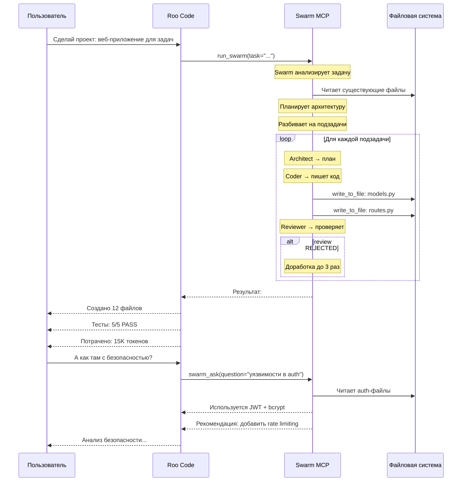
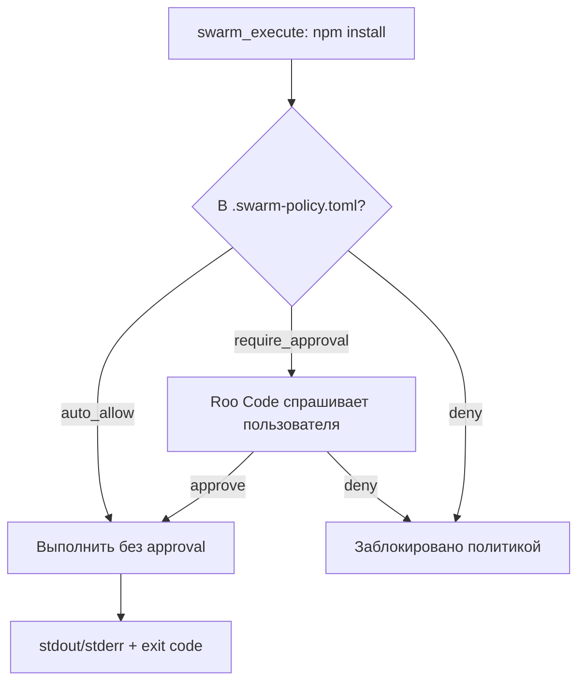
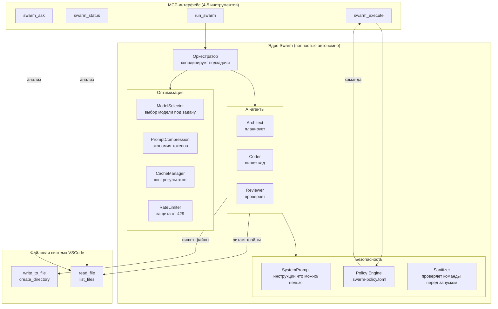
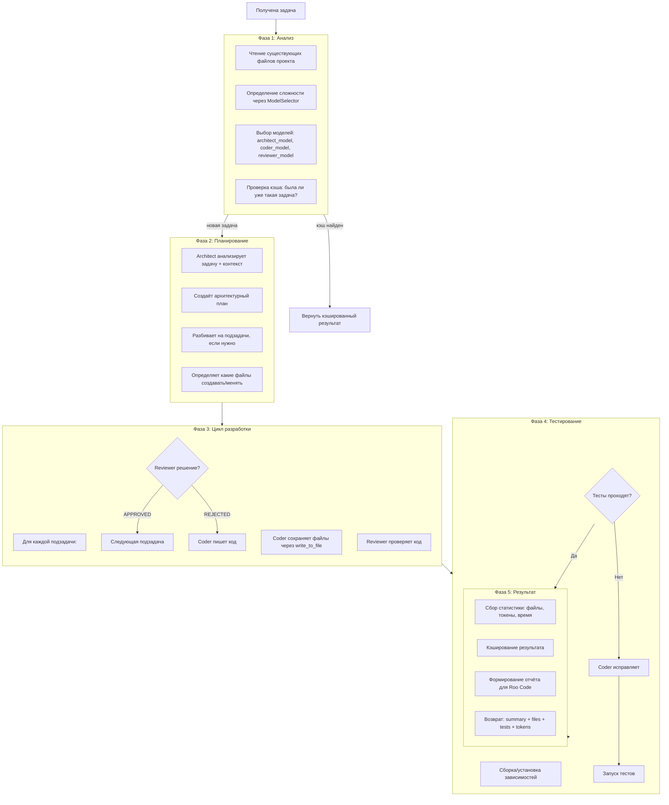

# Архитектура Swarm как продукта для Roo Code

## Философия

**Swarm — это AI-система, которая решает ВСЕ задачи по разработке проекта от начала до конца.**

Roo Code — "пульт управления". Пользователь говорит Roo Code задачу, Roo Code передаёт её Swarm, Swarm делает проект и возвращает результат.

```
Пользователь → [Чат с Roo Code] → run_swarm → [Swarm делает проект] → результат → Пользователь
```

Roo Code НЕ управляет внутренностями Swarm. Но Roo Code может запрашивать данные через инструменты, если нужно.

---

## 1. Принцип взаимодействия Roo Code ↔ Swarm



---

## 2. MCP-инструменты (продуктовый интерфейс)

Только те, что дают Roo Code **новые возможности**, которых у него нет.

### 2.1. `run_swarm` — Главный инструмент

**Назначение:** Запустить полный цикл разработки проекта или его части.

**Параметры:**
| Параметр | Тип | Обязательный | Описание |
|----------|-----|:---:|----------|
| `task` | string | ✅ | Задача на естественном языке |
| `context` | string | ❌ | Дополнительный контекст (файлы, архитектура, ограничения) |
| `mode` | string | ❌ | `"full"` (по умолч.) — пишет код, `"plan"` — только план, без записи |
| `files` | string[] | ❌ | Конкретные файлы для изменения (если нужно, а не весь проект) |

**Что возвращает:**
```json
{
  "status": "success",
  "summary": "Создано 12 файлов, изменено 3, удалён 1",
  "files": [
    {"path": "models/task.py", "action": "created", "lines": 45},
    {"path": "routes/api.py", "action": "created", "lines": 120},
    {"path": "main.py", "action": "modified", "diff": "+15/-3"}
  ],
  "tests": {"passed": 5, "failed": 0, "skipped": 1},
  "tokens": {"total": 15234, "cache_hits": 2},
  "plan": "Краткое описание что и почему сделано",
  "commands": [
    {"command": "pip install fastapi", "status": "pending"},
    {"command": "pytest tests/", "status": "completed", "output": "5 passed"}
  ]
}
```

**Что делает внутри:**
1. Анализирует задачу и существующий проект
2. Определяет сложность → выбирает модели (ModelSelector)
3. Разбивает на подзадачи (если проект большой)
4. Для каждой подзадачи запускает цикл Architect→Coder→Reviewer
5. Каждый Coder пишет файлы через write_to_file
6. Каждый Reviewer проверяет качество и безопасность
7. Команды терминала (если нужны) — через swarm_execute
8. Кэширует результат (CacheManager внутри)
9. Возвращает Roo Code полный отчёт

**Когда использовать в Roo Code:**
- Новая задача / новый проект
- Добавление функциональности
- Исправление ошибок
- Рефакторинг

---

### 2.2. `swarm_status` — Состояние проекта

**Назначение:** Показать что сделано, что осталось, общее состояние проекта.

**Параметры:**
| Параметр | Тип | Обязательный | Описание |
|----------|-----|:---:|----------|
| `scope` | string | ❌ | `"last"` — последний запуск, `"full"` — весь проект (по умолч.) |

**Что возвращает:**
```json
{
  "project": "task-manager",
  "files_total": 47,
  "files_created_last_run": 12,
  "tests": {"passed": 45, "failed": 2, "coverage": 78},
  "last_run": {
    "timestamp": "2026-04-30T20:00:00Z",
    "tokens": 15234,
    "duration_sec": 72.8
  },
  "issues": [
    {"severity": "warning", "message": "2 теста падают", "file": "tests/test_auth.py:42"},
    {"severity": "info", "message": "Нет CI/CD конфигурации"}
  ],
  "architecture": "FastAPI + SQLAlchemy + Vue.js"
}
```

**Когда использовать в Roo Code:**
- Пользователь спрашивает "как там проект?"
- После долгого запуска — проверить что получилось
- Перед новой задачей — понять текущее состояние

---

### 2.3. `swarm_ask` — Вопрос по проекту

**Назначение:** Задать вопрос, требующий анализа кода проекта.

**Параметры:**
| Параметр | Тип | Обязательный | Описание |
|----------|-----|:---:|----------|
| `question` | string | ✅ | Вопрос на естественном языке |
| `files` | string[] | ❌ | Ограничить анализ конкретными файлами |

**Примеры вопросов:**
- "Какая архитектура в проекте?"
- "Где узкое место по производительности?"
- "Есть ли уязвимости?"
- "Как улучшить структуру?"
- "Почему тест test_auth падает?"
- "Напиши документацию для этого API"

**Когда использовать в Roo Code:**
- Пользователь спрашивает что-то о проекте
- Нужно проанализировать код
- Нужна документация

---

### 2.4. `swarm_execute` — Безопасное выполнение команд

**Назначение:** Выполнить команду терминала с контролем безопасности.

**Параметры:**
| Параметр | Тип | Обязательный | Описание |
|----------|-----|:---:|----------|
| `command` | string | ✅ | Команда для выполнения |
| `timeout` | int | ❌ | Таймаут в секундах (по умолч. 60) |

**Безопасность (3 уровня):**



**Файл политик `.swarm-policy.tomл`:**
```toml
[safety]
auto_allow_commands = [
    "pip install",
    "npm install",
    "git status",
    "git diff",
    "python -m pytest",
    "python -m unittest",
    "node --version",
    "python --version",
]
require_approval = [
    "git push",
    "git commit",
    "rm -rf",
    "sudo",
    "docker",
    "> /dev/sda",  # опасные
    ":(){ :|:& };:", # fork bomb
]
deny_commands = [
    "rm -rf /",
    "chmod -R 777 /",
    "> /dev/sda",
]
max_execution_time = 120
max_concurrent = 2
```

**Когда использовать:**
- Swarm решил, что нужно запустить тесты
- Swarm решил, что нужно установить пакет
- Swarm решил, что нужно создать git commit

---

### 2.5. `swarm_files` (опционально) — Работа с файлами

**Назначение:** Если Roo Code нужно получить содержимое файлов, которые Swarm "видит", но Roo Code ещё нет.

**Параметры:**
| Параметр | Тип | Обязательный | Описание |
|----------|-----|:---:|----------|
| `pattern` | string | ✅ | Glob-паттерн (например, `**/*.py`) |

**Когда использовать:**
- После run_swarm Roo Code хочет увидеть что именно написано
- Редкий случай — обычно run_swarm возвращает достаточно информации

---

## 3. Внутренняя архитектура Swarm

### 3.1. Компоненты



### 3.2. Поток выполнения `run_swarm`



### 3.3. Формат результата `run_swarm`

Roo Code получает структурированный JSON с полной информацией:

```json
{
  "status": "success",
  "summary": "Создано 15 файлов, изменено 3. Тесты: 8/8 PASS",
  "plan_summary": "FastAPI приложение с SQLAlchemy, аутентификация через JWT",
  "files": [
    {"path": "app/__init__.py", "action": "created", "reason": "Пакет приложения"},
    {"path": "app/main.py", "action": "created", "reason": "Точка входа FastAPI"},
    {"path": "app/models/user.py", "action": "created", "reason": "Модель User"},
    {"path": "app/routes/auth.py", "action": "created", "reason": "Маршруты аутентификации"},
    {"path": "tests/test_auth.py", "action": "created", "reason": "Тесты аутентификации"},
    {"path": "requirements.txt", "action": "modified", "diff": "+5 строк"}
  ],
  "tests": {
    "command": "pytest tests/ -v",
    "passed": 8,
    "failed": 0,
    "output": "...краткий вывод pytest..."
  },
  "tokens": {
    "total": 28450,
    "architect": 8500,
    "coder": 14200,
    "reviewer": 5750,
    "cache_hits": 1,
    "cache_saved_tokens": 12000
  },
  "commands_executed": [
    {"command": "pip install -r requirements.txt", "approved": true, "status": "success"},
    {"command": "pytest tests/ -v", "approved": true, "status": "success"}
  ],
  "warnings": [],
  "suggestions": [
    "Добавить CI/CD через GitHub Actions",
    "Настроить pre-commit хуки"
  ]
}
```

---

## 4. Безопасность (ключевой момент)

### 4.1. Проблема: Swarm может запускать команды

Swarm может через `swarm_execute` запускать:
- `npm install` ✅ нормально
- `pytest` ✅ нормально
- `git push` ⚠️ опасно
- `rm -rf /` ❌ катастрофа

### 4.2. Решение: 4 уровня защиты

```
Уровень 1: System Prompt
  - Architect, Coder, Reviewer получают инструкцию:
    "НЕ запускай опасные команды. Для удаления файлов используй
     write_to_file с пустым содержимым, а не rm."

Уровень 2: .swarm-policy.toml
  - auto_allow: pip install, pytest, git status
  - require_approval: git push, rm -rf, sudo
  - deny: rm -rf /, fork bomb
  - Файл в корне проекта, пользователь может редактировать

Уровень 3: Sanitizer (код)
  - Перед запуском каждая команда проверяется:
    * Нет ли её в deny-списке?
    * Если в require_approval → Roo Code спрашивает пользователя
    * Если не знакома → Roo Code спрашивает пользователя

Уровень 4: Roo Code approval
  - Инструмент swarm_execute НЕ в alwaysAllow
  - Roo Code показывает пользователю: "Разрешить: npm install?"
  - Пользователь: Да / Нет / Всегда разрешать
```

### 4.3. Как Roo Code узнает что всё в порядке

```
run_swarm возвращает:
{
  "files": [...],           ← какие файлы созданы/изменены
  "tests": {...},           ← тесты проходят
  "commands_executed": [...], ← какие команды были запущены
  "warnings": [...]         ← предупреждения, если есть
}

→ Roo Code видит: 12 файлов создано, 0 ошибок, тесты PASS
→ Пишет пользователю: "Проект готов. Создано 12 файлов, тесты проходят.
   Нужно запустить git push — разрешаешь?"
→ Пользователь видит результат и принимает решение
```

---

## 5. Что это даёт Roo Code / пользователю

### Новая возможность: "Сделай проект" без ручного управления

**Без Swarm:**
```
Пользователь → Roo Code Architect (план) → Roo Code Code (пишет код)
→ Roo Code Debug (тестирует) → может быть много итераций и ручной работы
```

**Со Swarm:**
```
Пользователь → "Сделай проект" → run_swarm → всё само → результат
```

### Конкретные выгоды:

| Аспект | Roo Code без Swarm | Со Swarm |
|--------|-------------------|----------|
| **Качество кода** | Один AI-агент на задачу | 3 специализированных агента + цикл ревью |
| **Сложность задач** | Простые/средние | Любая сложность (автоматический выбор модели) |
| **Токены** | Полная стоимость каждый раз | Кэш экономит до 50% на повторных задачах |
| **Время** | Нужно следить и направлять | Отдал задачу → получил результат |
| **Безопасность** | Roo Code сам решает | Политики + approval |
| **Контекст** | Только текущий разговор | Кэшированные знания между запусками |

---

## 6. План реализации

### Фаза 1: Ядро (что уже есть — довести до ума)

```
Текущее состояние:
  ✅ run_swarm — работает (Architect→Coder→Reviewer)
  ✅ SwarmRunner — работает
  ✅ ModelSelector — работает
  ✅ CacheManager — работает
  ✅ PromptCompression — работает

Что сделать:
  ⬜ run_swarm возвращает структурированный JSON (сейчас — только текст)
  ⬜ Добавить поддержку mode="plan" (dry-run, без записи файлов)
  ⬜ Улучшить отчёт: какие файлы, тесты, токены
```

### Фаза 2: Новые инструменты

```
  ⬜ server.py: добавить swarm_status
  ⬜ server.py: добавить swarm_ask
  ⬜ server.py: добавить swarm_execute
  ⬜ server.py: добавить опциональный swarm_files
```

### Фаза 3: Безопасность

```
  ⬜ Создать policy.py — загрузка .swarm-policy.toml
  ⬜ Создать executor.py — безопасный запуск команд с Sanitizer
  ⬜ Системный промпт для агентов: правила безопасности
  ⬜ Тесты: команды из auto_allow, require_approval, deny
```

### Фаза 4: Конфигурация

```
  ⬜ .roo/mcp.json: удалить agent-orchestration
  ⬜ .roo/mcp.json: переименовать code-swarm → swarm
  ⬜ .roo/mcp.json: alwaysAllow = ["run_swarm", "swarm_status", "swarm_ask"]
  ⬜ .roo/mcp.json: НЕ добавлять swarm_execute в alwaysAllow
```

### Фаза 5: Тесты

```
  ⬜ test_server.py: тесты для новых инструментов
  ⬜ test_executor.py: тесты безопасности (команды из deny блокируются)
  ⬜ test_policy.py: загрузка и валидация политик
  ⬜ Интеграционный: run_swarm → создание файлов → проверка
```

---

## 7. Резюме

**Количество MCP-инструментов:** 5 (run_swarm, swarm_status, swarm_ask, swarm_execute, swarm_files)

**Внутренних компонентов (не MCP, автоматика):** 7 (ModelSelector, CacheManager, PromptCompression, RateLimiter, PolicyEngine, Sanitizer, Orchestrator)

**Новых файлов:** 4 (status.py, ask.py, executor.py, policy.py)

**Изменяемых файлов:** 3 (server.py, config.py, __init__.py)

**Удаляемых зависимостей:** 1 (npm-пакет agent-orchestration)

---

## Вопрос

Это та архитектура, которую ты хочешь? Если да — переключаюсь в Code и реализую.
