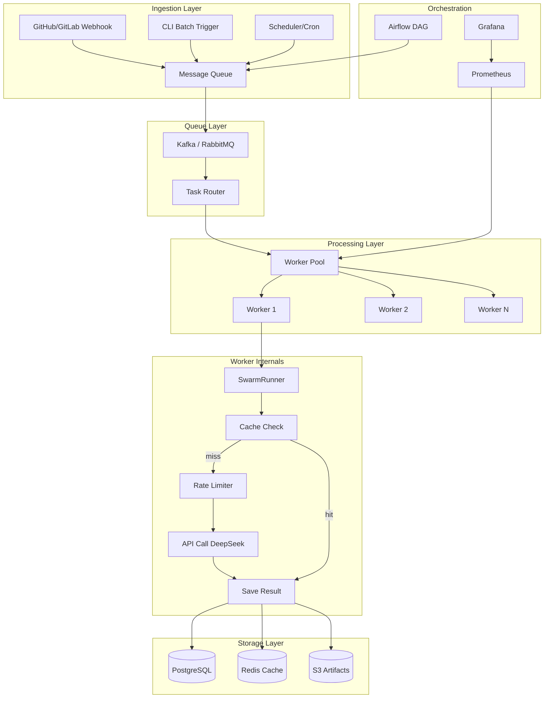
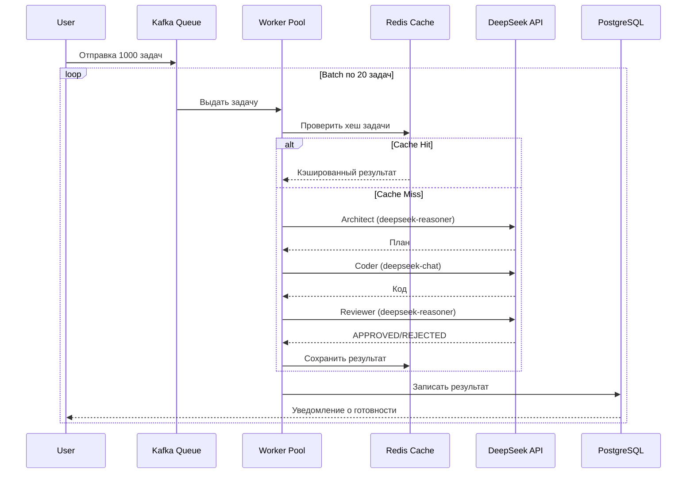
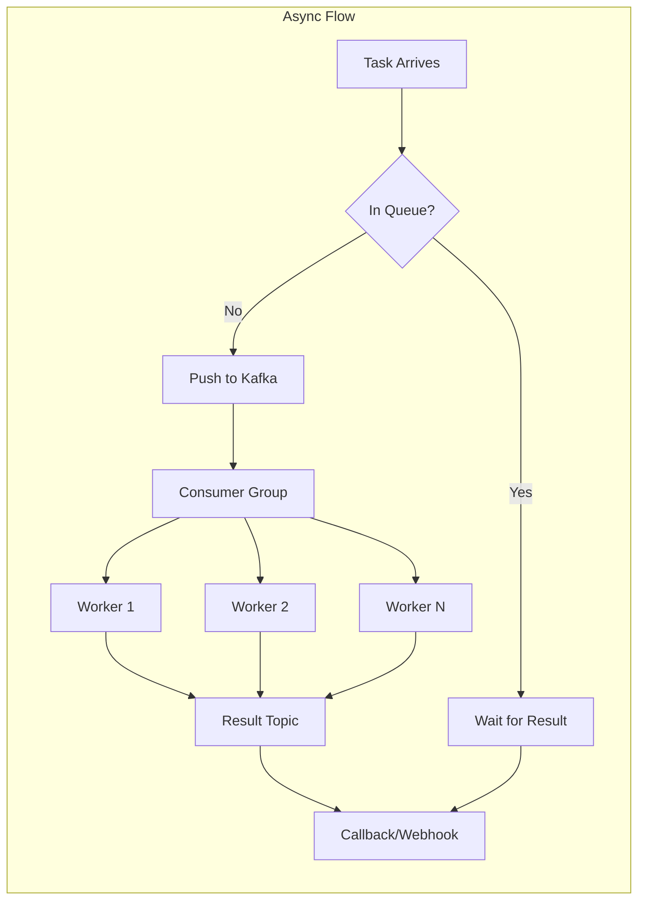

# Архитектура масштабирования роя AI-агентов

## Промышленная спецификация

**Версия:** 1.0
**Дата:** 2026-04-29
**Цель:** Масштабирование роя AI-агентов (Architect + Coder + Reviewer) для обработки 1000+ файлов в 50 000+ репозиториях

---

## Содержание

1. [Текущая архитектура](#1-текущая-архитектура)
2. [Проблемы масштабирования](#2-проблемы-масштабирования)
3. [Целевая архитектура](#3-целевая-архитектура)
4. [Компоненты системы](#4-компоненты-системы)
5. [Скорость — параллельная обработка](#5-скорость--параллельная-обработка)
6. [Качество — контекстная осведомлённость](#6-качество--контекстная-осведомлённость)
7. [Экономия токенов — кэш и оптимизация](#7-экономия-токенов--кэш-и-оптимизация)
8. [Развёртывание и инфраструктура](#8-развёртывание-и-инфраструктура)
9. [Мониторинг и observability](#9-мониторинг-и-observability)
10. [План внедрения](#10-план-внедрения)
11. [Оценка стоимости](#11-оценка-стоимости)

---

## 1. Текущая архитектура

```
                             ┌──────────────────┐
                             │   Roo Code MCP    │
                             │  (один клиент)   │
                             └────────┬─────────┘
                                      │
                             ┌────────▼─────────┐
                             │   SwarmRunner     │
                             │  (один процесс)  │
                             └────────┬─────────┘
                                      │
                   ┌──────────────────┼──────────────────┐
                   ▼                  ▼                  ▼
             ┌──────────┐      ┌──────────┐      ┌──────────┐
             │Architect │ ──→  │  Coder   │ ──→  │ Reviewer │
             │(1 вызов) │      │(1 вызов) │      │(1 вызов) │
             └──────────┘      └──────────┘      └──────────┘
                                      │
                                ┌─────▼─────┐
                                │  Memory   │
                                │  Saver    │
                                └───────────┘
```

**Ограничения:**
- Последовательная обработка — 1 задача за раз
- Нет кэширования — каждый запуск платит полную стоимость
- Нет контекста проекта — каждый файл анализируется изолированно
- Один процесс — не использует многоядерность CPU
- Нет rate limiting — рискует сжечь тариф при пачковой отправке

---

## 2. Проблемы масштабирования

| Проблема | Сейчас | Нужно для 1000 файлов |
|----------|--------|----------------------|
| **Время выполнения** | ~15 сек на задачу | ~4 часа (последовательно) → нужно < 5 мин |
| **Стоимость API** | ~$0.01/задача | ~$10 за 1000 задач → нужно < $1 |
| **Контекст проекта** | Отсутствует | Каждый файл в контексте всего репозитория |
| **Надёжность** | Нет retry | 1 отказ убьёт всю пачку |
| **Rate limits** | Не контролируется | DeepSeek: ~500 RPM, превышение → 429 |
| **Хранение** | Нет | Нужно хранить результаты анализа |

---

## 3. Целевая архитектура



### Схема потока данных



---

## 4. Компоненты системы

### 4.1. Очередь задач (Message Queue)

**Технология:** Apache Kafka (или RabbitMQ для меньшего масштаба)

```python
# Пример структуры задачи в Kafka
{
    "task_id": "uuid-1234",
    "repository": "org/repo-name",
    "file_path": "src/main.py",
    "task_type": "code_review",      # code_review | refactor | test_generation
    "context": {
        "language": "python",
        "framework": "fastapi",
        "project_profile": "profile-uuid",
        "related_files": ["src/models.py", "src/routes.py"]
    },
    "priority": 1,                    # 1-5 (1 = highest)
    "max_cost_cents": 5,             # мягкий лимит стоимости
    "created_at": "2026-04-29T18:00:00Z"
}
```

**Плюсы Kafka:**
- Partitioning по репозиторию — гарантирует порядок задач для одного репо
- Retention — можно переиграть упавшие задачи
- Consumer groups — горизонтальное масштабирование воркеров

### 4.2. Пул воркеров (Worker Pool)

**Технология:** Docker + Kubernetes (Deployment с HPA)

```yaml
# kubernetes/worker-deployment.yaml
apiVersion: apps/v1
kind: Deployment
metadata:
  name: swarm-worker
spec:
  replicas: 20                    # HPA auto-scales до 200
  selector:
    matchLabels:
      app: swarm-worker
  template:
    spec:
      containers:
      - name: worker
        image: swarm-worker:latest
        env:
        - name: DEEPSEEK_API_KEY
          valueFrom:
            secretKeyRef:
              name: deepseek-secret
              key: api-key
        - name: WORKER_ID
          valueFrom:
            fieldRef:
              fieldPath: metadata.name
        resources:
          requests:
            memory: "512Mi"
            cpu: "500m"
          limits:
            memory: "2Gi"
            cpu: "2"
```

**Лучшие практики:**
- **Horizontal Pod Autoscaler** — автомасштабирование по длине очереди
- **Pod Disruption Budget** — минимум 10 воркеров всегда работают
- **Resource requests/limits** — 512MB RAM / 0.5 CPU на воркер
- **Graceful shutdown** — воркер завершает текущую задачу перед остановом

### 4.3. SwarmRunner (оптимизированный)

```python
class ScalableSwarmRunner:
    """Production-ready версия SwarmRunner с кэшем, rate limiting и мониторингом."""

    def __init__(self, config: SwarmConfig):
        self.config = config
        self.cache = Cache(  # diskcache
            directory="./.swarm_cache",
            size_limit=10_000_000_000,  # 10GB
            eviction_policy="least-recently-used"
        )
        self.rate_limiter = SlidingWindowRateLimiter(
            max_calls=500,          # DeepSeek RPM
            window_seconds=60
        )
        self.metrics = MetricsCollector()
        self.semaphore = asyncio.Semaphore(10)  # макс 10 параллельных

    async def process_task(self, task: Task) -> TaskResult:
        async with self.semaphore:
            # 1. Проверка кэша
            cache_key = self._make_cache_key(task)
            cached = self.cache.get(cache_key)
            if cached:
                self.metrics.inc("cache_hit")
                return TaskResult.from_cache(cached, task)

            # 2. Rate limiting
            await self.rate_limiter.wait()
            self.metrics.inc("api_call")

            # 3. Запуск роя с таймаутом
            try:
                result = await asyncio.wait_for(
                    self._run_swarm(task),
                    timeout=120.0  # 2 минуты на задачу
                )
                self.cache.set(cache_key, result, expire=3600)
                self.metrics.inc("success")
                return result

            except asyncio.TimeoutError:
                self.metrics.inc("timeout")
                # fallback: быстрый анализ без архитектора
                return await self._run_fast_fallback(task)

            except Exception as e:
                self.metrics.inc("error")
                raise

    async def process_batch(self, tasks: list[Task]) -> list[TaskResult]:
        """Параллельная обработка батча."""
        return await asyncio.gather(
            *[self.process_task(t) for t in tasks],
            return_exceptions=True
        )
```

### 4.4. Слой кэширования

**Технология:** Redis Cluster (распределённый) + diskcache (локальный)

| Уровень | Технология | Время жизни | Размер | Назначение |
|---------|-----------|-------------|--------|------------|
| L1 | diskcache (локальный) | 1 час | 10 GB | Повторные задачи на одном воркере |
| L2 | Redis Cluster | 24 часа | 100 GB | Шардированный кэш между воркерами |
| L3 | S3 / MinIO | 30 дней | ∞ | Долгосрочное хранение артефактов |

**Ключ кэша — комбинация факторов:**
```python
def _make_cache_key(self, task: Task) -> str:
    """Хеш, учитывающий не только задачу, но и модель, температуру и контекст."""
    content = json.dumps({
        "task": task.content,
        "model": task.architect_model,
        "temperature": task.temperature,
        "profile": task.project_profile,
    }, sort_keys=True)
    return hashlib.sha256(content.encode()).hexdigest()
```

---

## 5. Скорость — параллельная обработка

### 5.1. Стратегия батчинга

```python
BATCH_SIZE = 20              # задач на один батч
MAX_WORKERS = 50             # параллельных воркеров
BATCH_INTERVAL = 1.0         # сек между батчами (rate limiting)

async def process_repository(repo_path: str, files: list[str]):
    """Обрабатывает все файлы репозитория батчами."""
    batches = [
        files[i:i + BATCH_SIZE]
        for i in range(0, len(files), BATCH_SIZE)
    ]
    
    for batch in batches:
        tasks = [create_task(f, repo_path) for f in batch]
        results = await worker_pool.process_batch(tasks)
        await save_results(results)
        await asyncio.sleep(BATCH_INTERVAL)  # защита от rate limit
```

### 5.2. Приоритизация

```python
PRIORITY_MAP = {
    1: {"models": "deepseek-reasoner", "timeout": 300},
    2: {"models": "deepseek-reasoner", "timeout": 120},
    3: {"models": "deepseek-chat",    "timeout": 60},
    4: {"models": "deepseek-chat",    "timeout": 30},
    5: {"models": "deepseek-chat",    "timeout": 15},
}

# Высокий приоритет: критические файлы, security review
# Средний приоритет: основные модули
# Низкий приоритет: тесты, документация, конфиги
```

### 5.3. Асинхронная архитектура



---

## 6. Качество — контекстная осведомлённость

### 6.1. Профиль проекта (Project Profile)

Каждый репозиторий имеет JSON-профиль, который передаётся всем агентам как контекст:

```json
{
    "profile_id": "repo-org/project-uuid",
    "name": "my-fastapi-service",
    "language": "python",
    "version": "3.12",
    "framework": "FastAPI 0.110",
    "code_style": {
        "line_length": 120,
        "indentation": 4,
        "quotes": "double",
        "naming": {
            "functions": "snake_case",
            "classes": "PascalCase",
            "constants": "UPPER_CASE"
        }
    },
    "dependencies": [
        "fastapi", "sqlalchemy", "pydantic", "alembic"
    ],
    "architecture": {
        "pattern": "layered",
        "layers": ["routes", "services", "repositories", "models"],
        "dependency_rule": "services -> repositories -> models"
    },
    "testing": {
        "framework": "pytest",
        "coverage_threshold": 80,
        "fixtures_path": "tests/fixtures/"
    },
    "exceptions": {
        "allow_prints": false,
        "allow_wildcard_imports": false,
        "max_function_length": 50
    }
}
```

**Генерация профиля** — автоматически при первом анализе репозитория:

```python
class ProjectProfileGenerator:
    """Анализирует репозиторий и создаёт профиль."""

    def generate(self, repo_path: str) -> ProjectProfile:
        return ProjectProfile(
            language=self._detect_language(repo_path),
            framework=self._detect_framework(repo_path),
            code_style=self._analyze_code_style(repo_path),
            dependencies=self._parse_requirements(repo_path),
            architecture=self._detect_architecture(repo_path),
        )

    def _analyze_code_style(self, repo_path: str) -> CodeStyle:
        """Собирает статистику по существующему коду для имитации стиля."""
        # ruff / black / flake8 stat
        # median line length, naming patterns
        return CodeStyle(...)
```

### 6.2. RAG-контекст (Retrieval-Augmented Generation)

```python
class ContextBuilder:
    """Собирает контекст для задачи из файлов репозитория."""

    def __init__(self):
        self.embeddings = OpenAIEmbeddings(model="text-embedding-3-small")
        self.vector_store = Chroma(collection_name="repo_context")

    def build_context(self, task: Task, repo_path: str, top_k: int = 5) -> str:
        """Находит top_k наиболее релевантных файлов для задачи."""

        # Индексируем репозиторий (однократно)
        if not self.vector_store._collection.count():
            self._index_repository(repo_path)

        # Поиск релевантных файлов
        query = f"{task.content} {task.file_path}"
        results = self.vector_store.similarity_search(query, k=top_k)

        context_parts = [
            f"### Файл: {doc.metadata['file_path']}\n"
            f"```{doc.metadata['language']}\n{doc.page_content}\n```"
            for doc in results
        ]

        return "\n\n".join(context_parts)
```

### 6.3. Граф зависимостей

```python
class DependencyGraph:
    """Строит граф импортов файла для передачи ревьюеру."""

    def build(self, repo_path: str, target_file: str) -> dict:
        """Возвращает граф зависимостей для файла."""
        
        # importlib + ast обход
        imports = self._extract_imports(target_file)
        dependents = self._find_dependents(repo_path, target_file)
        
        return {
            "file": target_file,
            "imports": [
                {"module": i, "is_local": self._is_local(i)}
                for i in imports
            ],
            "depended_by": dependents[:10],   # top 10
            "change_impact": self._estimate_impact(imports, dependents)
        }
```

---

## 7. Экономия токенов — кэш и оптимизация

### 7.1. Стратегия кэширования

```
Уровень 1 — Точное совпадение (хеш):
  Экономия: 100% стоимости
  Когда: точно та же задача, модель, температура
  
Уровень 2 — Семантическое совпадение (embedding):
  Экономия: 60-80%
  Когда: похожая задача (другой файл, тот же тип)
  
Уровень 3 — Частичный кэш (план → код):
  Экономия: 30-40%
  Когда: план можно переиспользовать, код генерируется заново
```

### 7.2. Prompt compression

```python
class PromptCompressor:
    """Сжимает промпты для экономии токенов."""

    def __init__(self, target_ratio: float = 0.5):
        self.target_ratio = target_ratio

    def compress(self, prompt: str) -> str:
        """Удаляет из промпта несущественную информацию."""

        # 1. Удаление комментариев из кода
        prompt = self._remove_comments(prompt)

        # 2. Удаление пустых строк
        prompt = re.sub(r'\n{3,}', '\n\n', prompt)

        # 3. Сокращение длинных имён (если > 40 символов)
        prompt = self._shorten_long_names(prompt)

        # 4. Удаление docstrings (оставить только сигнатуры)
        prompt = self._strip_docstrings(prompt)

        return prompt
```

### 7.3. Адаптивный выбор модели

```python
class ModelSelector:
    """Выбирает модель на основе сложности задачи."""

    COMPLEXITY_HEURISTICS = {
        "high": [
            "security", "architecture", "refactoring",
            "performance", "concurrency"
        ],
        "medium": [
            "feature", "bugfix", "api", "database"
        ],
        "low": [
            "test", "docs", "config", "format", "typo"
        ]
    }

    def select(self, task: Task) -> ModelConfig:
        keywords = task.content.lower()

        if any(kw in keywords for kw in self.COMPLEXITY_HEURISTICS["high"]):
            return ModelConfig(
                architect="deepseek-reasoner",
                coder="deepseek-chat",
                reviewer="deepseek-reasoner"
            )

        if any(kw in keywords for kw in self.COMPLEXITY_HEURISTICS["medium"]):
            return ModelConfig(
                architect="deepseek-chat",
                coder="deepseek-chat",
                reviewer="deepseek-chat"
            )

        # Low complexity — быстрый проход
        return ModelConfig(
            architect="deepseek-chat",
            coder="deepseek-chat",
            reviewer=None     # пропустить ревью
        )
```

### 7.4. Rate Limiter с adaptive backoff

```python
class AdaptiveRateLimiter:
    """Адаптивный rate limiter с учётом ответов API."""

    def __init__(self, initial_rpm: int = 500):
        self.current_rpm = initial_rpm
        self.last_429_at = None
        self.backoff_factor = 2

    async def acquire(self):
        """Ждёт, пока не освободится слот."""
        now = time.time()

        # Если был 429 — снижаем RPM и ждём
        if self.last_429_at and (now - self.last_429_at) < 60:
            self.current_rpm = max(10, self.current_rpm // self.backoff_factor)

        # Ждём
        wait_time = 60.0 / self.current_rpm
        await asyncio.sleep(wait_time)

    def report_429(self):
        """API вернул 429 Too Many Requests."""
        self.last_429_at = time.time()
        logger.warning(f"Rate limited. Reducing RPM: {self.current_rpm} -> {self.current_rpm // 2}")

    def report_success(self):
        """Успешный вызов — можно попробовать увеличить RPM."""
        if not self.last_429_at:
            self.current_rpm = min(500, self.current_rpm + 5)
```

---

## 8. Развёртывание и инфраструктура

### 8.1. Docker-образ

```dockerfile
# Dockerfile
FROM python:3.12-slim AS builder

WORKDIR /app
COPY requirements.txt .
RUN pip install --no-cache-dir -r requirements.txt

FROM python:3.12-slim
WORKDIR /app

# Только runtime-зависимости
COPY --from=builder /usr/local/lib/python3.12/site-packages /usr/local/lib/python3.12/site-packages
COPY --from=builder /usr/local/bin /usr/local/bin

COPY swarm/ ./swarm/
COPY .env.example .env

# Не-root пользователь
RUN useradd -m -u 1000 swarm && chown -R swarm:swarm /app
USER swarm

CMD ["python", "-m", "swarm.worker"]
```

### 8.2. Kubernetes-стек

```yaml
# kubernetes/kustomization.yaml
resources:
  - namespace.yaml
  - redis-cluster.yaml
  - kafka-cluster.yaml
  - worker-deployment.yaml
  - worker-hpa.yaml
  - postgres-statefulset.yaml
  - ingress.yaml
  - monitoring/
```

**HPA (Horizontal Pod Autoscaler):**

```yaml
apiVersion: autoscaling/v2
kind: HorizontalPodAutoscaler
metadata:
  name: swarm-worker-hpa
spec:
  scaleTargetRef:
    apiVersion: apps/v1
    kind: Deployment
    name: swarm-worker
  minReplicas: 10
  maxReplicas: 200
  metrics:
  - type: Resource
    resource:
      name: cpu
      target:
        type: Utilization
        averageUtilization: 70
  - type: External
    external:
      metric:
        name: kafka_consumer_lag
      target:
        type: AverageValue
        averageValue: 100
```

### 8.3. CI/CD Pipeline

```yaml
# .github/workflows/deploy.yml
name: Deploy Swarm Workers

on:
  push:
    branches: [main]
  workflow_dispatch:

jobs:
  test:
    runs-on: ubuntu-latest
    steps:
      - uses: actions/checkout@v4
      - run: pip install -r requirements.txt
      - run: python test_mock_swarm.py

  build-and-push:
    needs: test
    runs-on: ubuntu-latest
    steps:
      - uses: actions/checkout@v4
      - name: Build and push Docker image
        uses: docker/build-push-action@v5
        with:
          push: true
          tags: |
            ghcr.io/myorg/swarm-worker:latest
            ghcr.io/myorg/swarm-worker:${{ github.sha }}

  deploy:
    needs: build-and-push
    runs-on: ubuntu-latest
    steps:
      - name: Deploy to Kubernetes
        run: |
          kubectl set image deployment/swarm-worker \
            worker=ghcr.io/myorg/swarm-worker:${{ github.sha }}
          kubectl rollout status deployment/swarm-worker
```

---

## 9. Мониторинг и observability

### 9.1. Метрики Prometheus

```python
from prometheus_client import Counter, Histogram, Gauge

# Счётчики
tasks_total = Counter("swarm_tasks_total", "Total tasks processed", ["status"])
api_calls_total = Counter("swarm_api_calls_total", "API calls", ["model", "agent"])
cache_hits_total = Counter("swarm_cache_hits_total", "Cache hits")

# Гистограммы
task_duration = Histogram(
    "swarm_task_duration_seconds",
    "Task processing time",
    buckets=[1, 5, 10, 30, 60, 120, 300]
)
api_latency = Histogram(
    "swarm_api_latency_seconds",
    "API call latency",
    ["model"],
    buckets=[0.1, 0.5, 1, 2, 5, 10]
)

# Gauges
queue_depth = Gauge("swarm_queue_depth", "Current queue depth")
workers_active = Gauge("swarm_workers_active", "Active workers")
daily_cost = Gauge("swarm_daily_cost_usd", "Estimated daily cost")
```

### 9.2. Дашборд Grafana

**Ключевые панели:**

| Панель | Метрика | Порог алерта |
|--------|---------|-------------|
| Task throughput | tasks_total / minute | < 10 — undervalued |
| P95 latency | task_duration p95 | > 120s — медленно |
| Error rate | tasks_total{status="error"} / total | > 5% |
| Cache hit rate | cache_hits / total | < 20% — кэш неэффективен |
| API cost | daily_cost | > $50/day |
| Queue depth | queue_depth | > 1000 — добавить воркеров |
| Rate limit hits | api_calls_total{status="429"} | > 10/min |

### 9.3. Логирование (ELK)

```python
import structlog

logger = structlog.get_logger()

# Структурированное логирование
logger.info("task_processed",
    task_id=task.id,
    repo=task.repository,
    duration_sec=duration,
    total_tokens=tokens,
    cost_usd=round(cost, 4),
    cache_hit=cached,
    model=model_used,
)
```

---

## 10. План внедрения

### Фаза 1: Быстрые победы (1-2 дня)

- [x] Базовая архитектура роя (уже сделано)
- [x] MCP-сервер (уже сделано)
- [ ] Кэш результатов (`diskcache`)
- [ ] Rate limiter
- [ ] Параллельная обработка (`ThreadPoolExecutor`)

### Фаза 2: Средний масштаб (1-2 недели)

- [ ] Docker-контейнер
- [ ] Redis-кэш (шардированный)
- [ ] PostgreSQL для хранения результатов
- [ ] Profile проекта (JSON)
- [ ] Адаптивный выбор модели
- [ ] Prometheus + Grafana

### Фаза 3: Промышленный масштаб (2-4 недели)

- [ ] Kafka/RabbitMQ
- [ ] Kubernetes (HPA, PDB)
- [ ] Airflow DAG для сложных пайплайнов
- [ ] RAG-контекст (embeddings + vector search)
- [ ] GitHub Actions CI/CD
- [ ] Rate limiter с adaptive backoff
- [ ] Alertmanager (PagerDuty/Slack)

### Фаза 4: Оптимизация (ongoing)

- [ ] Prompt compression
- [ ] Семантический кэш
- [ ] A/B тестирование моделей
- [ ] Cost allocation по репозиториям
- [ ] Автомасштабирование по предсказанию нагрузки

---

## 11. Оценка стоимости

### 11.1. DeepSeek API

| Модель | Input $/M токенов | Output $/M токенов | Средний запрос |
|--------|------------------|-------------------|----------------|
| deepseek-chat | $0.27 | $1.10 | ~1000 токенов |
| deepseek-reasoner | $0.55 | $2.19 | ~2000 токенов |

**Стоимость за задачу (средняя):**

| Сценарий | Architect | Coder | Reviewer | Всего |
|----------|-----------|-------|----------|-------|
| Базовая (все deepseek-chat) | $0.001 | $0.001 | $0.001 | **$0.003** |
| Стандарт (reasoner + chat + reasoner) | $0.004 | $0.001 | $0.004 | **$0.009** |
| Максимум (все reasoner) | $0.004 | $0.004 | $0.004 | **$0.012** |

### 11.2. Инфраструктура

| Компонент | Стоимость/мес | Примечание |
|-----------|--------------|------------|
| Kubernetes (10 подов) | ~$300 | DigitalOcean / Hetzner |
| Redis Cluster (3 узла) | ~$150 | Upstash / Redis Cloud |
| Kafka | ~$200 | Confluent / Redpanda |
| PostgreSQL | ~$100 | Managed |
| S3-совместимое хранилище | ~$50 | Backblaze B2 / MinIO |
| **Итого инфраструктура** | **~$800/мес** | |

### 11.3. Итого для 1000 задач/день

| Статья | День | Месяц |
|--------|------|-------|
| API (стандарт ~$0.009 × 1000) | $9 | $270 |
| Инфраструктура | $27 | $800 |
| **Всего** | **$36/день** | **~$1,070/мес** |

С кэшированием (hit rate 60%): **~$600/мес**

---

## Приложение: Ключевые решения (ADR)

### ADR-001: Почему Kafka, а не RabbitMQ

**Контекст:** Нужна очередь для 50 000+ репозиториев
**Решение:** Apache Kafka
**Обоснование:**
- Partitioning по репозиторию — гарантия порядка
- Retention — можно откатить ошибки
- Consumer groups — горизонтальное масштабирование
- RabbitMQ: лучше для < 10 000 задач/день

### ADR-002: Почему Redis, а не Memcached

**Контекст:** Кэш результатов + rate limiting
**Решение:** Redis Cluster
**Обоснование:**
- Redis поддерживает структуры данных (sorted sets для rate limiting)
- Pub/Sub для уведомлений
- Persistence (RDB/AOF) — кэш не теряется при рестарте
- Cluster mode — горизонтальное масштабирование

### ADR-003: Почему Pydantic, а не TypedDict

**Контекст:** Валидация состояния графа и задач
**Решение:** Pydantic BaseModel
**Обоснование:**
- Runtime-валидация типов
- Автоматическая сериализация/десериализация JSON
- Поля с дефолтными значениями
- Совместимость с LangGraph v0.3+

---

*Документ создан: 2026-04-29*
*Версия: 1.0*
*Автор: Roo (Orchestrator)*
